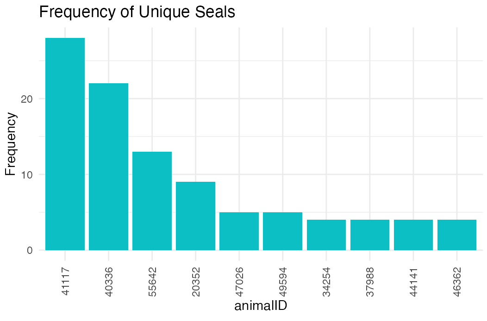
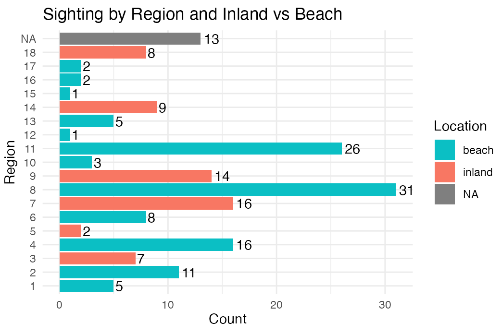
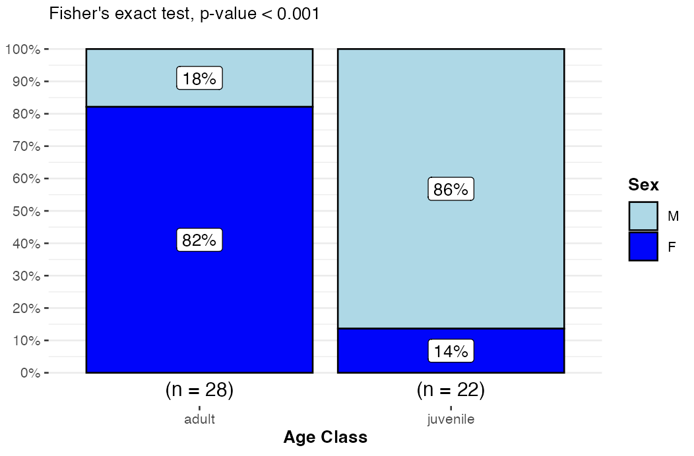
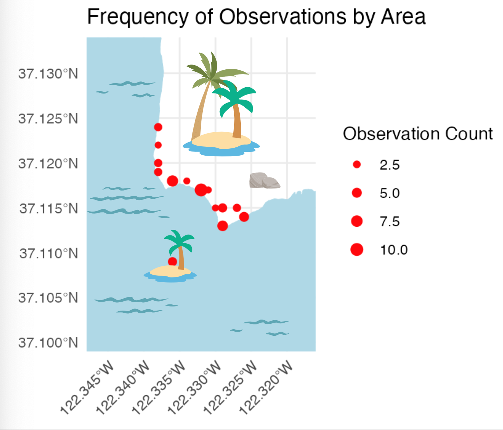

## Introduction {#sec-intro}

Northern elephant seals are a seasonal resident of Año Nuevo State Park in San Mateo County, California. This species is a keystone species, serving as an indicator of its marine environments, and researchers’ observations of the animals on land can often point to individuals’ experiences at sea (@beltran2025). The goal of this project is to perform exploratory data analysis on key variables relating to the prevalence and survivorship of shark bites on the Año Nuevo colony of elephant seals. By learning more about the predator-prey dynamics these animals experience, scientists hope to understand more about the several marine ecosystems in which they exist (@andrzejaczek2022). For our research questions, we will focus on the following:

1.  How do rates of shark bites differ between sex and age classes?

2.  Do sex and/or age predict the likelihood of a shark bite’s location on the body?

3.  In which areas of the colony do shark-bitten elephant seals appear more frequently?

Our dataset is subsetted from privately available data from the ongoing population monitoring effort of Año Nuevo State Park between the years of 1979 and 2024. This dataset, selected from observations indicating the presence of a shark bite on an observed seal, contains 225 observations with 106 unique seals. Therefore, the dataset and research questions outlined above are limited by the survivorship bias exhibited by seals who survived their trip to land and were observed at the Año Nuevo colony. For our research questions, we focused on the following categorical variables from the greater dataset as detailed below:

-   animalID: a four- to five-digit numeric identifier unique to a seal, assigned upon first observation,
-   regionID: areas numbered one through nineteen representing locations throughout the park where the seal was observed, simplified from colony map locations, 
-   age class: a seal’s observed age recoded as binary, either adult ("ad”) or juvenile ("juv"),
-   sex: a seal’s observed sex, either male (M) or female (F), and 
-   bite location: where on the seal’s body a bite was observed, three-level: head or neck (“end”), body (“body”), or flippers (“flip”), coded from string comments.

## Exploratory Data Analysis

Data cleaning mainly consisted of recoding string entries into categories and/or new variables and removing any irrelevant cases (i.e., observations from different colonies or of seals with non-predatory, “cookie cutter shark” bites). Of the columns we used for our analysis, 43 out of the 180 rows remaining after cleaning had at least one missing value, which we did not alter for analyses. The aforementioned variables are summarized below. 

The graph below displays the top 10 most frequently observed seals in the dataset, with animalID 41117 being the most observed at 27 observations (Figure 1). To account for multiple potential observations per seal, the dataset was sorted by animalID and only the most recent observation for each seal was retained for analyses. 

{#fig-one fig-align="left" width="5in"}

In the bar plot below, counts of seals per regionID are colored by whether their location was on the beach or inland, with missing data on location for 13 seals (Figure 2). The numbers indicated for regionID correlate with those on the accompanying map (Figure 3). Based on this plot, we can see that a majority of seals were sighted around the middle of the colony between and including sites 4 to 11, with the beach locations being the most frequented.

{#fig-two width="441"}

{#fig-three width="3.5in"}

The next bar plot shows the frequency of each bite location per a seal’s sex (Figure 4). As depicted, females appear to receive bites on their body most frequently, disproportionately more so than males or seals whose sex was not recorded.

{#fig-four width="456"}

The following table displays contingencies of sex and age class status to characterize individuals in the dataset. The most common category of observed seals are adult females. The sample sizes within groupings indicate insufficient counts for a Chi-square test of independence.

|        | Adult | Juvenile |
|--------|-------|----------|
| Female | 23    | 2        |
| Male   | 5     | 19       |

: Contingencies of Sex by Age class. {#tbl-one}

Overall, the data appear unevenly distributed, with a far smaller number of unique seal observations than previously expected based on the size of the dataset. This finding indicates that analyses requiring high statistical power may not be appropriate for these data.

## Methods {#sec-meth}

**Bite Demographics**

To explore how rates of shark bites differ between sex and age classes, we used Fisher’s Exact Test, as it is the most appropriate method when frequency groupings differ disproportionately or are exceptionally small. We completed this analysis using the base R command *fisher.test().*   

**Bite Body Location**

To determine whether bites on certain areas of the body were more likely for certain demographic groups of seals, we fitted three separate logistic regression models for each location on the body (end, body, and flippers). By creating binary variables for each bite location (presence indicated by 1, absence indicated by 0), we were able to create regression models fitting age and sex as predictors of each bite location with an interaction term between the two predictors:
$$
logit = log(\frac{p}{1-p}) = \beta_0 + \beta_1X_1 + \beta_2X_2 + \beta_3X_1X_2
$$

Assumptions were assessed using built-in functions in R, and analyses were performed in base R using the function *glm().* Graphs were computed using ggplot2 (@patil2021).

**Bite Geographic Location**

Lastly, to explore the frequency of shark-bitten seals by location, we used the *sf* package (@pebesma2018) to visualize counts on a georeferenced map of the park. As the purpose of this visualization was exploratory, graphing frequencies alone without analyzing significant differences was appropriate. To do this, we derived coordinate points from the average center of each regionID using GoogleEarthPro. These coordinates were transferred into a csv file, imported into R, and transformed into a simple feature object. Our reference map was sourced from the San Mateo County GIS imagery database and specified to just the area of the colony. This map was also imported and transformed into a shape file before graphing frequencies of observations by regionID coordinate, with point size indicating observation frequency. This final map was graphed using ggplot2.

## Results {#sec-verify}

**Fisher's Exact Test**

Counts between groupings were significantly different (*p* \< .001), with adults more likely to be female and juveniles more likely to be male (Figure 5).

{#fig-five width="456"}

**Logistic Regression**

Data used for logistic regression analysis failed to meet assumptions. Specifically, the data is non-normally distributed and has unequal variance. As such, we were unable to conduct logistic regressions as planned.

**Frequency Mapping**

As depicted in the graph, there are three main locations on which seals haul out with shark bites: the north end, south end, and middle of the colony (Figure 6).

{#fig-six width="350"}

## Discussion & Conclusion {#sec-conc}

Our original research questions aimed at identifying trends in shark bite survivorship. We found that survivorship differs significantly against sex and age classes, with female adults and male juveniles exhibiting bites most frequently. This result suggests that different age classes and sexes exhibit different patterns in survivorship, and perhaps predation, possibly due to their different body sizes and foraging ecologies.

Unfortunately, analysis assumptions were not met for our logistic regression analyses, so we were unable to explore quantitatively whether or not age or sex predict shark bite location on the body. However, exploratory data analysis suggests that female seals may have a disproportionately high number of bites on their body (as opposed to flippers or head or rear) compared to male and unidentified seals.

Finally, mapping efforts demonstrate that shark-bitten seals appear more frequently on the main beach areas of the colony: North Point, South Point, and Mid Bight. These locations align well with anecdotal reports which suggest that seals aggregate more frequently in these large beaches over inland gullies and vegetated areas.

Our results are limited by the survivorship bias that prevails in on-shore sight-resight efforts. Current research being conducted in collaborating labs seeks to characterize predator movement ecology to better understand the trends observed here. Future work may also consider the role of prey sex and age class in optimal foraging of predators. Finally, ongoing research aims to describe aggregation patterns of seals by microhabitat characteristics such as substrate type. As stated at the beginning of this report, these research projects serve the scientific knowledge base by contributing a fundamental understanding of ecological dynamics across several ecosystems. This work informs the conservation and regulation of key marine species and environments during this era of extreme climate change.

## References
