# Paper Reproduction Walkthrough Template

## Overview

This template guides you through the process of reproducing a statistical research paper. Fill this out as you work through your reproduction - it serves as both your workflow guide and your final report.

**Important:** As you encounter issues during reproduction, immediately document them in the **Issues Log** (Part 7). Don't wait until the end!

------------------------------------------------------------------------

## Part 1: Initial Paper Scan

### 1.1 Basic Information

| Field | Information |   |
|-------------------------------|----------------------|-------------------|
| **Title** | "Teaching modeling in Introductory Statistics: A comparison of formula and tidyverse syntaxes |  |
| **Authors** | Amelia McNamara |  |
| **Year** | 2024 |  |
| **Journal** | Journal of Statistics and Data Science Education |  |
| **DOI** | https://doi.org/10.1080/26939169.2024.2394545 |  |
| **Your Name** | Sharry Eydel |  |
| **Date Started** | April 17, 2026 |  |

### 1.2 Quick Assessment

**What is this paper about?** (1-2 sentences) In this paper, the author compares the effects and experiences of two sets of students in an introductory statistics course: one group is taught tidyverse and the other is taught formula. She compares the time spent watching pre-lab videos, the number of lines of code written, and the number of times a function is repeated, as well as a few qualitative surveys to help teachers make the choice on which code syntax is better to teach to their students.

**Is data available?** ☑ Yes ☐ Partial ☐ No

**Is code available?** ☑ Yes ☐ Partial ☐ No

**Are statistical methods clearly stated?** ☐ Yes ☑ Somewhat ☐ No

------------------------------------------------------------------------

## Part 2: GO/NO-GO Decision

### Decision Tree

```         
1. Is ANY data available?
   └─ NO → STOP (cannot reproduce without data)
   └─ YES → Continue to #2

2. Is code available OR are methods clearly described?
   └─ NO → STOP (too difficult to reproduce)
   └─ YES → Continue to #3

3. Do you have the skills/time to reproduce this?
   └─ NO → STOP (consider a different paper)
   └─ YES → PROCEED WITH REPRODUCTION
```

### Your Decision

**Will you proceed?** ☑ Yes ☐ No

**Reproduction type:** - ☑ Full reproduction (data + code available) - ☐ Computational reproduction (data available, writing own code) - ☐ Partial reproduction (some data/code missing)

**Why this decision?** All the data and code used in the final paper was free and available. It also helped that she left the draft of her paper in the GitHub, as it contained all the the graphs and tables she used in her final paper, and made comparison easier.

------------------------------------------------------------------------

## Part 3: Understanding the Paper

### 3.1 Abstract & Research Question

**Abstract summary (3-5 sentences):** An intorductory statistics course had two sections, where one learned the formala R syntax and the other learned the tidyverse R syntax. The formula section watched less videos but spent more time computing, while the tidyverse section watched more videos but spent less time computing. They also had longer videos and more lines of code to write in their work. The tidyverse section had more repetition of functions. The professor had difficulty teaching relationships between two categorical variables, mostly for the tidyverse section.

**Main research question(s):** Which R syntax is better to teach in an introductory statistics course: formula or tidyverse?

**Key findings:** Overall, formula syntax is simplier for students to learn and use, and can be used for the entirety of an introductory statistics course. However, students who plan to take additional statistics or data science classes and will need to learn data wrangling would benefit from learning tidyverse.

### 3.2 Statistical Methods Used

List the main statistical methods (you'll understand these better as you reproduce):

| Method | Brief Description | Used For |
|-------------------|----------------------------------|-------------------|
| Descriptive Stats | The author finds the frequency and range of a majority of the data they collected. They also have a box plot of the Linkert Ratings given by students before and after the class. | Everything (lol) |

------------------------------------------------------------------------

## Part 4: Data Assessment

### 4.1 Data Inventory

**How many datasets does the paper use?** *7*

For each dataset, fill out a table:

**Dataset 1:**

| Aspect | Details |
|----------------------------------|--------------------------------------|
| **Dataset name** | allfunctions_packages |
| **Description** | Counts the number of times a function from a specific library was used in the homework by section. |
| **Sample size (n)** | 41 |
| **Number of variables** | 5 (section, text, n, package, metapackage) |
| **Available?** | ☑ Yes ☐ Partial ☐ No |
| **Source/Location** | GitHub |
| **DOI/Link** | https://github.com/AmeliaMN/ComparingSyntaxForModeling/blob/main/data/processed/allfunctions_packages.xlsx |
| **Format** | xlsx (Exel) |

**Dataset 2:**

| Aspect | Details |
|----------------------------------|--------------------------------------|
| **Dataset name** | allfunctions |
| **Description** | Counts the number of times a function was used in the homework by section. |
| **Sample size (n)** | 41 |
| **Number of variables** | 3 (section, text, n) |
| **Available?** | ☑ Yes ☐ Partial ☐ No |
| **Source/Location** | GitHub |
| **DOI/Link** | https://github.com/AmeliaMN/ComparingSyntaxForModeling/blob/main/data/processed/allfunctions.csv |
| **Format** | CSV |

**Dataset 3:**

| Aspect | Details |
|----------------------------------|--------------------------------------|
| **Dataset name** | csfunctions |
| **Description** | Contains the frequency of the use of the functions listed in the class "cheat sheet", which had all the possible functions that could be used in both sections. |
| **Sample size (n)** | 41 |
| **Number of variables** | 3 (section, text, n) |
| **Available?** | ☑ Yes ☐ Partial ☐ No |
| **Source/Location** | GitHub |
| **DOI/Link** | https://github.com/AmeliaMN/ComparingSyntaxForModeling/blob/main/data/processed/csfunctions.csv |
| **Format** | CSV |

**Dataset 4:**

| Aspect | Details |
|----------------------------------|--------------------------------------|
| **Dataset name** | lablines |
| **Description** | Lists the types of activities done in the lab to differentiate the labs, and the number of lines each section had per lab. |
| **Sample size (n)** | 13 |
| **Number of variables** | 3 (file, lines, section) |
| **Available?** | ☑ Yes ☐ Partial ☐ No |
| **Source/Location** | GitHub |
| **DOI/Link** | https://github.com/AmeliaMN/ComparingSyntaxForModeling/blob/main/data/processed/lablines.csv |
| **Format** | CSV |

**Dataset 5:**

| Aspect | Details |
|----------------------------------|--------------------------------------|
| **Dataset name** | rstudio_cloud |
| **Description** | Contains the number of hours students spent in/using RStudios by month and section. |
| **Sample size (n)** | 41 |
| **Number of variables** | 4 (ID, month, amount, section) |
| **Available?** | ☑ Yes ☐ Partial ☐ No |
| **Source/Location** | GitHub |
| **DOI/Link** | https://github.com/AmeliaMN/ComparingSyntaxForModeling/blob/main/data/processed/rstudio_cloud.csv |
| **Format** | CSV |

**Dataset 6:**

| Aspect | Details |
|----------------------------------|--------------------------------------|
| **Dataset name** | youtube_videos |
| **Description** | Contains all the available data for the videos students watched during the course. It also seperates the videos by section, week, publish date, title, and topic. |
| **Sample size (n)** | 40 (videos total) |
| **Number of variables** | 13 (week, Video, Video title, week_topic, Video publish time, Unique viewers, Views, Watch time (hours), Subscribers, Impressions, Impressions click-through rate (%), weeknum, section, tot_sec, tot_min) |
| **Available?** | ☑ Yes ☐ Partial ☐ No |
| **Source/Location** | GitHub |
| **DOI/Link** | https://github.com/AmeliaMN/ComparingSyntaxForModeling/blob/main/data/processed/youtube_videos.csv |
| **Format** | CSV |

**Dataset 7:**

| Aspect | Details |
|----------------------------------|--------------------------------------|
| **Dataset name** | youtube_weeks |
| **Description** | Contains the number of videos each sections was required to watch per week, and extra data related to watch time and topic per section. |
| **Sample size (n)** | 41 |
| **Number of variables** | 13 (week, section, n_videos, watches, uniques, hours, tot_length, topic, tot_min, mpu, mps, percent_per_student, percent_per_user) |
| **Available?** | ☑ Yes ☐ Partial ☐ No |
| **Source/Location** | GitHub |
| **DOI/Link** | https://github.com/AmeliaMN/ComparingSyntaxForModeling/blob/main/data/processed/youtube_weeks.csv |
| **Format** | CSV |

------------------------------------------------------------------------

### 4.2 Data Wrangling & Preprocessing

**What did the authors do to prepare the data?**

For each dataset, document the authors' data cleaning steps:

**Dataset 1 - Preprocessing:**

| Step | Author's Description | Details/Notes |
|-------------------|-------------------------------|----------------------|
| 1\. Nothing | N/A | This is the raw data file used for the first figure. |

**Your data preparation:**

| Step | What You Did            | Matches Paper?       | Notes |
|------|-------------------------|----------------------|-------|
| 1\.  | Download the .xlsx file | ☑ Yes ☐ No ☐ Unclear |       |

**Final sample size:** - Paper reports: n = 41 - You obtained: n = 41 - Match? ☑ Yes ☐ No

**Dataset 2 and 3:**

| Step | Author's Description | Details/Notes |
|-------------------|-------------------------------|----------------------|
| 1\. Get all the R code | Process the RMarkdown files into R script files |  |
| 2\. Parse the code | They use the function `getParseData()` to parse the files, and find the functions that are used. |  |
| 3\. Parse the cheat sheet file | The professor wanted to parse these documents separately. This section of the document goes through that process, which is very similar to steps 1 and 2 above. | csfunctions are the functions from the Cheat Sheet. |

**Your data preparation:**

| Step | What You Did | Matches Paper? | Notes |
|------------------|------------------|-------------------|------------------|
| 1\. | Downloaded the entire data file from the GitHub. | ☑ Yes ☐ No ☐ Unclear |  |
| 2\. | Ran the preprocessing file "CountingFunctions.Rmd" | ☑ Yes ☐ No ☐ Unclear |  |
| 3\. | Compared the results | ☑ Yes ☐ No ☐ Unclear |  |

**Final sample size:** - Paper reports: n = 41 - You obtained: n = 41 - Match? ☑ Yes ☐ No

**Dataset 4:**

| Step | Author's Description | Details/Notes |
|-------------------|-------------------------------|----------------------|
| 1\. Get the names of all the RMarkdown files | Uses the "here" package to get the files. |  |
| 2\. Read the RMarkdown files | Uses pipes to clean null values and rename columns. |  |
| 3\. Join the formula and tidyverse data | Uses mutates and bind_rows to combine data from both sections. |  |
| 4\. Write out the data (into a file) | Makes the csv file and sends it to "processed" folder. |  |

**Your data preparation:**

| Step | What You Did | Matches Paper? | Notes |
|------------------|------------------|-------------------|------------------|
| 1\. | Downloaded the entire data file from the GitHub. | ☑ Yes ☐ No ☐ Unclear |  |
| 2\. | Ran the preprocessing file "CountingLines.Rmd" | ☑ Yes ☐ No ☐ Unclear |  |
| 3\. | Compared the results | ☑ Yes ☐ No ☐ Unclear |  |

**Final sample size:** - Paper reports: n = 13 - You obtained: n = 13 - Match? ☑ Yes ☐ No

**Dataset 5:**

| Step | Author's Description | Details/Notes |
|-------------------|-------------------------------|----------------------|
| 1\. Downloads all the raw data | Uses "fromJSON" to get raw data. | The November Data for Tidyverse was missing. |
| 2\. Combines the data together | Uses a "join_left" to combine the different months into one data table. |  |
| 3\. Annonymizes the data | Uses pipelines to remove names and user ids. |  |
| 4\. Reads back in anonymous data. | Uses read_csv this time. | During this process, it reads data back in, and it says 21 rows for the tidyverse section, but only 20 rows for the formula section. I don't know why. |
| 5\. Computes summary statistics | Uses "summarize" function. |  |
| 6\. Creates final processed dataset | Makes data into a .csv file and sends it to "processed" folder. |  |

**Your data preparation:**

| Step | What You Did | Matches Paper? | Notes |
|------------------|------------------|-------------------|------------------|
| 1\. | Downloaded the entire data file from the GitHub. | ☑ Yes ☐ No ☐ Unclear |  |
| 2\. | Ran the preprocessing file "RStudioCloudData.Rmd" | ☑ Yes ☐ No ☐ Unclear |  |
| 3\. | Compared the results | ☑ Yes ☐ No ☐ Unclear |  |

**Final sample size:** - Paper reports: n = 41 - You obtained: n = 41 - Match? ☑ Yes ☐ No

**Dataset 6:**

| Step | Author's Description | Details/Notes |
|-------------------|-------------------------------|----------------------|
| 1\. Import weekly raw youtube data | Data is read in using read_csv. |  |
| 2\. Combine all the data into one table | Uses pipelines and bind_rows to create table. |  |
| 3\. Add video length column | A new csv is added and mutated to make the length of the videos in minutes. |  |
| 4\. Annonymize the data | Names and other personal information is removed and the table is sent to the annonymous folder. |  |
| 5\. Clean the data futher | Missing data is removed and labels are standardized across table(s). |  |
| 6\. Makes a data set that contains information per video | A new csv file is made and sent to processed folder. |  |

**Your data preparation:**

| Step | What You Did | Matches Paper? | Notes |
|------------------|------------------|-------------------|------------------|
| 1\. | Downloaded the entire data file from the GitHub. | ☑ Yes ☐ No ☐ Unclear |  |
| 2\. | Ran the preprocessing file "YouTubeData.Rmd" | ☑ Yes ☐ No ☐ Unclear |  |
| 3\. | Compared the results | ☑ Yes ☐ No ☐ Unclear |  |

**Final sample size:** - Paper reports: n = 40 - You obtained: n = 40 - Match? ☑ Yes ☐ No

**Dataset 7:**

| Step | Author's Description | Details/Notes |
|-------------------|-------------------------------|----------------------|
| 1\. Does everything that was mentioned in Dataset 6 preprocessing | This is an extension of the "YouTubeData.Rmd" file. |  |
| 2\. Aggregates everything by week and section | Uses "group_by(week, section). |  |
| 3\. Calculates some engagement data | Minutes watched per unique viewer, per student, and the percentage of video watched. |  |
| 4\. Saves it all into a data set | Makes a new csv file and puts it in the "processed" folder. |  |

**Your data preparation:**

| Step | What You Did | Matches Paper? | Notes |
|------------------|------------------|-------------------|------------------|
| 1\. | Downloaded the entire data file from the GitHub. | ☑ Yes ☐ No ☐ Unclear |  |
| 2\. | Ran the preprocessing file "YouTubeData.Rmd" | ☑ Yes ☐ No ☐ Unclear |  |
| 3\. | Compared the results | ☑ Yes ☐ No ☐ Unclear |  |

**Final sample size:** - Paper reports: n = 41 - You obtained: n = 41 - Match? ☑ Yes ☐ No

------------------------------------------------------------------------

## Part 5: Code Assessment

### 5.1 Code Availability

**Is code available?** ☑ Fully ☐ Partially ☐ Not at all

**If yes, where?** GitHub

**Programming language(s):** ☑ R ☐ Python ☐ Other: \_\_\_

------------------------------------------------------------------------

### 5.2 Software Environment

**R/Python Version Information:**

| Software | Author's Version | Your Version    |
|----------|------------------|-----------------|
| R/Python | Not Specified    | R version 4.5.1 |
| IDE      | Not Specified    | RStudio 0.1.249 |

**Required Packages/Libraries:**

| Package | Author's Version | Your Version | Available? | Installation Issues? |
|---------------|---------------|---------------|---------------|---------------|
| tidyverse | Not Specified | 2.0.0 | ☑ Yes ☐ No | None |
| ggplot2 | Not Specified | 4.0.2 | ☑ Yes ☐ No | None |
| dplyr | Not Specified | 1.1.4 | ☑ Yes ☐ No | None |
| knitr | Not Specified | 1.50 | ☑ Yes ☐ No | None |
| here | Not Specified | 1.0.2 | ☑ Yes ☐ No | None |
| kableExtra | Not Specified | 1.4.0 | ☑ Yes ☐ No | None |
| broom.mixed | Not Specified | 0.2.9.7 | ☑ Yes ☐ No | None |
| bookdown | Not Specified | 0.46 | ☑ Yes ☐ No | None |
| ggh4x | Not Specified | 0.3.1 | ☑ Yes ☐ No | None |
| readxl | Not Specified | 1.4.5 | ☑ Yes ☐ No | None |
| extrafont | Not Specified | 0.20 | ☑ Yes ☐ No | None - not sure if necessary if you change the code to not use "CM Roman" |
| mosaic | Not Specified | 1.9.2 | ☑ Yes ☐ No | None |
| infer | Not Specified | 1.1.0 | ☑ Yes ☐ No | None |
| cowplot | Not Specified | 1.2.0 | ☑ Yes ☐ No | None |
| lme4 | Not Specified | 1.1-37 | ☑ Yes ☐ No | None |
| palmerpenguins | Not Specified | 0.1.1 | ☑ Yes ☐ No | None - Not required for analysis, only examples of student assignments |
| rticles | Not Specified | 0.27 | ☑ Yes ☐ No | None - Not necessary to run code, thought it fixed an error but didn't. |

## **NOTE:** Paper does not specify the packages used for the analysis, or their version.

### 5.3 Code Functionality Check

**Fill this out as you run the code:**

| Code Section | Purpose | Runs Successfully? | Errors Encountered | How You Fixed It |
|---------------|---------------|---------------|---------------|---------------|
| Paper formatting (1-3) | Runs code so that the document is nicely formatted. | ☑ Yes ☐ No ☐ Partial | 1 | `here::i_am("PaperDraft.Rmd")` was changed to match the name and location of the current document. |
| Import data (4) | Imports all of the data from the .csv and .xlsx files | ☑ Yes ☐ No ☐ Partial | 1 | `read_excel("data/processed/allfunctions_packages.xlsx")` was changed to `readxl::read_excel(here("data", "processed", "allfunctions_packages.xlsx"))` |
| Example code of different syntaxes. | Show how different syntaxes achieve the same results. | ☑ Yes ☐ No ☐ Partial | 0 |  |
| Counting n (6) and Prior experience (7,8) | Author counts the number of students who consented to have their survey reviewed and the results | ☑ Yes ☐ No ☐ Partial | 0 |  |
| Figure 1 (Code block 9) | Shows the differences in the length of pre-lab documents and videos between sections. | ☑ Yes ☐ No ☐ Partial | 0 |  |
| Finding descriptive statistics (10-12) | Uses the data tables and pipes to find simple numbers and information. | ☑ Yes ☐ No ☐ Partial | 1 | Code block 12 didn't load right. Got rid of ````` ```` ````` before and after the block. |
| Figure 2 (13,14) | Shows differences and percentages of responses to Likert-scale surveys. | ☑ Yes ☐ No ☐ Partial | 0 |  |
| Figure 3 (15,16) | Shows differences in pre/post surveys of the Likert rating question responses as box plots for each section and by topic. | ☑ Yes ☐ No ☐ Partial | 0 |  |
| Additional Survey Questions code results (17-19) | Gets the results of survey questions for written description of section. | ☑ Yes ☐ No ☐ Partial | 0 |  |
| Figure 4 (20-22) | Shows how many students watched the YouTube videos, and how much of the videos were watched. | ☑ Yes ☐ No ☐ Partial | 1 | Code block 20 contained `label_fontfamily = "CM Roman"` which caused errors. I changed "CM Roman" to "Ariel" and it worked. |
| Figure 5 (23-25) | To compare compute time in RStudio Cloud per section for each month. | ☑ Yes ☐ No ☐ Partial | 0 |  |
| More Descriptive Statistics (26-31) | Uses code to find more descriptive statistics for paper. | ☑ Yes ☐ No ☐ Partial | 0 |  |
| Figure 6 (32-35) | Compares the amount of repetitions done per function by section. | ☑ Yes ☐ No ☐ Partial | 0 |  |
| Descriptive statistic finding or examples of code done in class (36-58) | Contains mostly code blocks showing what students were expected to due during labs. Some code used for more descriptive statistics. | ☑ Yes ☐ No ☐ Partial | 0 |  |
| Formating for "Functions Used" section (59-61) | Formats the last 3 code blocks that contain and compare the functions used for both sections. | ☑ Yes ☐ No ☐ Partial | 0 |  |

------------------------------------------------------------------------

### 5.4 Random Seeds & Reproducibility

**Does the paper specify random seeds?** ☐ Yes (seed = \_\_\_) ☑ No

**Your approach:** - If paper specifies seed: Use it - If not: Document your seed = 885

**Seed sensitivity check:**

| Seed Value | Result                  |
|------------|-------------------------|
| 885        | Figures match the Paper |
| 127        | Figures match the Paper |
| 216        | Figures match the Paper |

**Are results stable across seeds?** ☑ Yes ☐ No ☐ Somewhat

**Note:** Since all the figures are detailing descriptive statistics, and not taking any random samples from the data, the figures shouldn't change by seed.

------------------------------------------------------------------------

## Part 6: Figure & Table Reproduction

### 6.1 Figures/Tables Inventory

List all figures and tables you're attempting to reproduce:

| Figure/Table | Description | Code Available? | Attempted? | Reproducible? | Results Match? | Notes |
|-----------|-----------|-----------|-----------|-----------|-----------|-----------|
| Figure 1 | Describes the lengths of the pre-lab material given to students by section and week. | ☑ Yes ☐ No ☐ Partial | ☑ Yes ☐ No | ☑ Yes ☐ No | ☑ Yes ☐ Mostly ☐ No |  |
| Figure 2 | Shows the pre- and post- survey results to Likert-scale questions for each section and by topic. | ☑ Yes ☐ No ☐ Partial | ☑ Yes ☐ No | ☑ Yes ☐ No | ☑ Yes ☐ Mostly ☐ No |  |
| Figure 3 | Distribution of paired differences for student responses to questions, broken down by section. | ☑ Yes ☐ No ☐ Partial | ☑ Yes ☐ No | ☑ Yes ☐ No | ☑ Yes ☐ Mostly ☐ No |  |
| Figure 4 | Contains histograms of (a) the average number of unique viewers per video, (b) the estimate proportion of video content watched, and (c) approximate number of minutes watched per YouTube Video, per student. | ☑ Yes ☐ No ☐ Partial | ☑ Yes ☐ No | ☑ Yes ☐ No | ☑ Yes ☐ Mostly ☐ No |  |
| Figure 5 | Graphs of the hours of computing time each section spent on RStudio Cloud, by month (1 month per graph). | ☑ Yes ☐ No ☐ Partial | ☑ Yes ☐ No | ☑ Yes ☐ No | ☑ Yes ☐ Mostly ☐ No |  |
| Figure 6 | Two graphs with the most used 17 functions per section. | ☑ Yes ☐ No ☐ Partial | ☑ Yes ☐ No | ☑ Yes ☐ No | ☑ Yes ☐ Mostly ☐ No |  |

------------------------------------------------------------------------

### 6.2 Detailed Results Comparison

For key results, create detailed comparison tables:

**Figure 1:**

***Paper:***

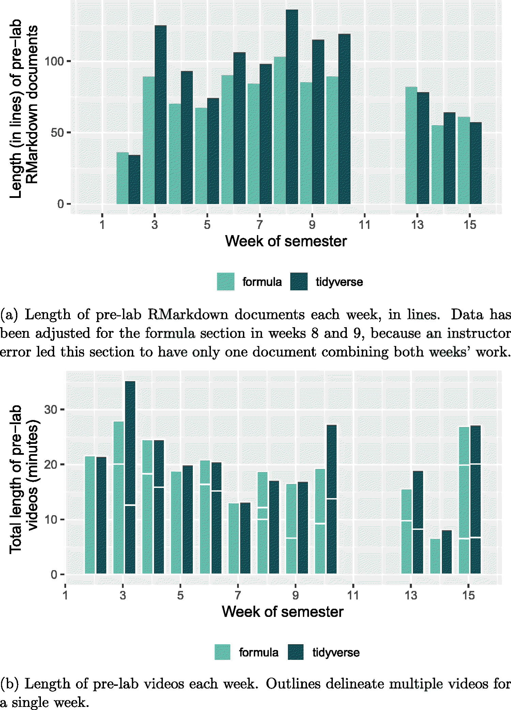

***Your Result:***

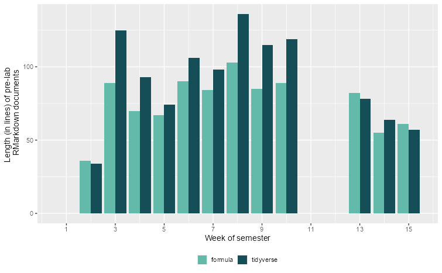

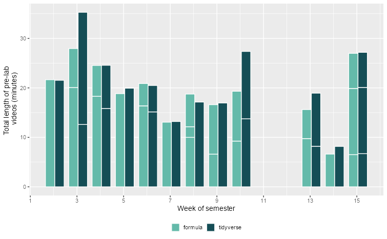

***Match:*** ☑ Yes ☐ Close ☐ No

**Figure 2:**

***Paper:***

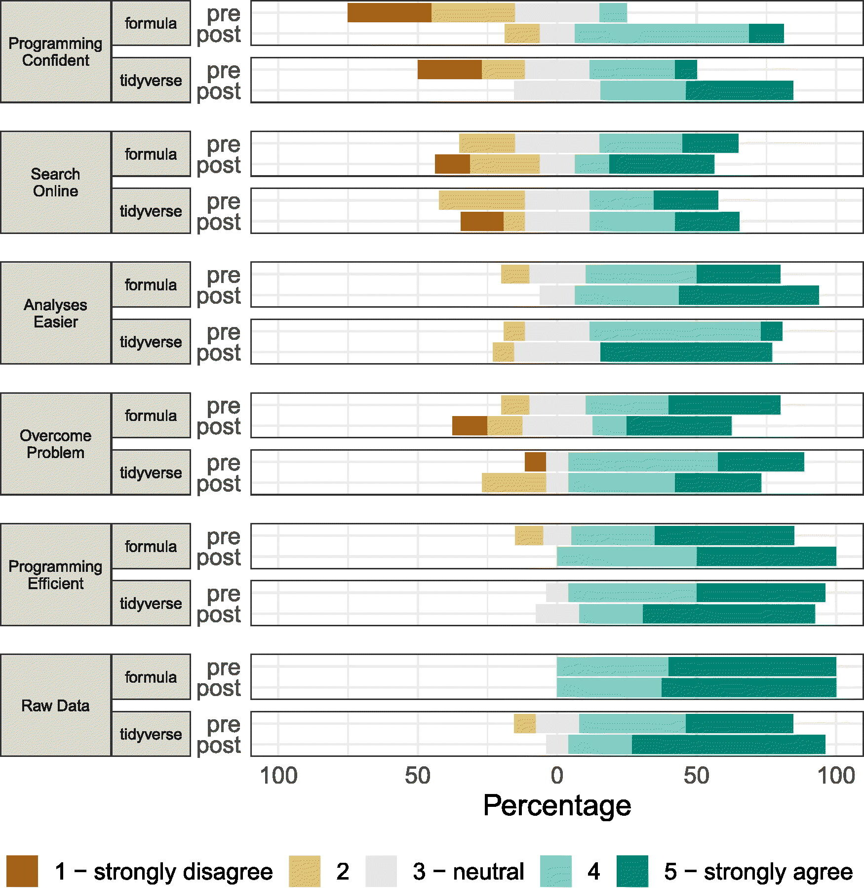

***Your Result:***

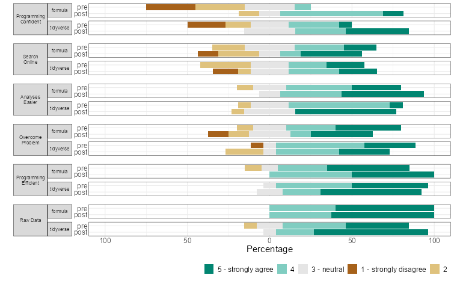

***Match:*** ☑ Yes ☐ Close ☐ No

**Figure 3:**

***Paper:***

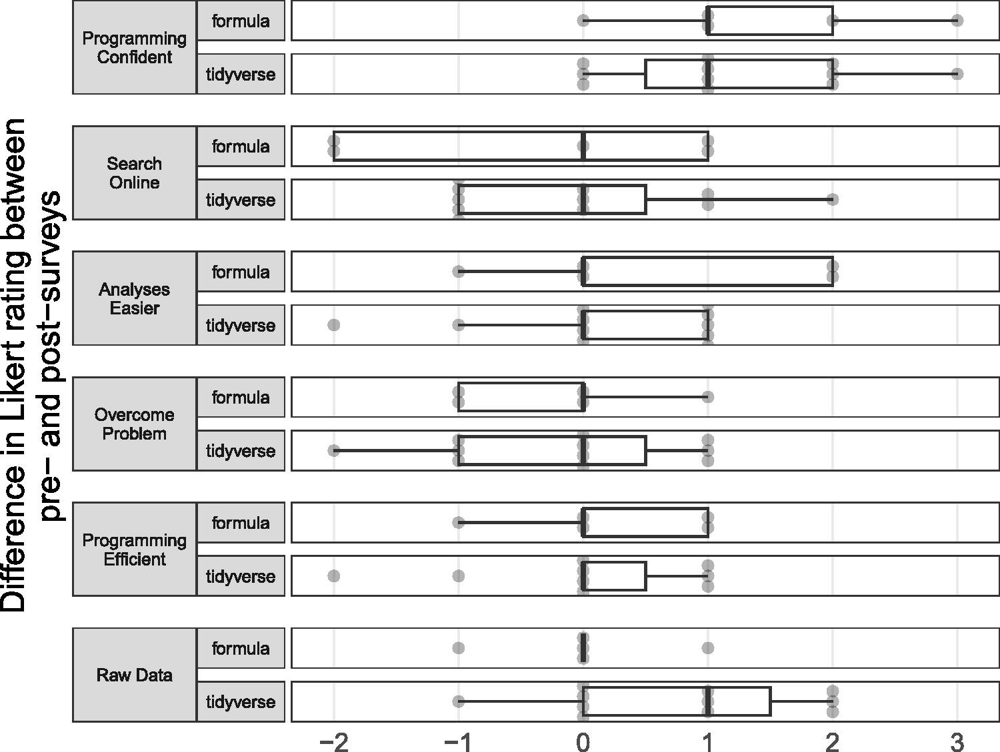

***Your Result:***

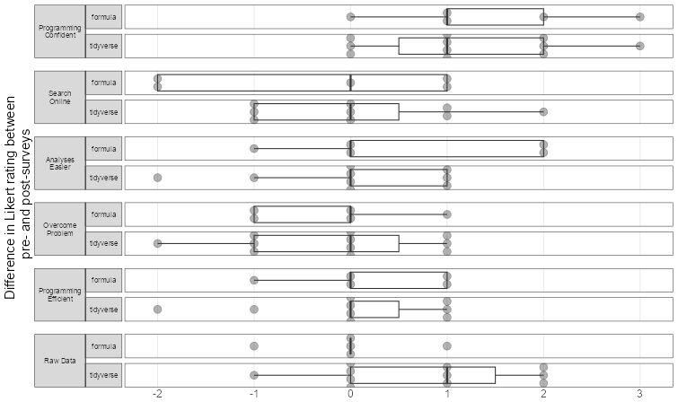

***Match:*** ☑ Yes ☐ Close ☐ No

**Figure 4:**

***Paper:***

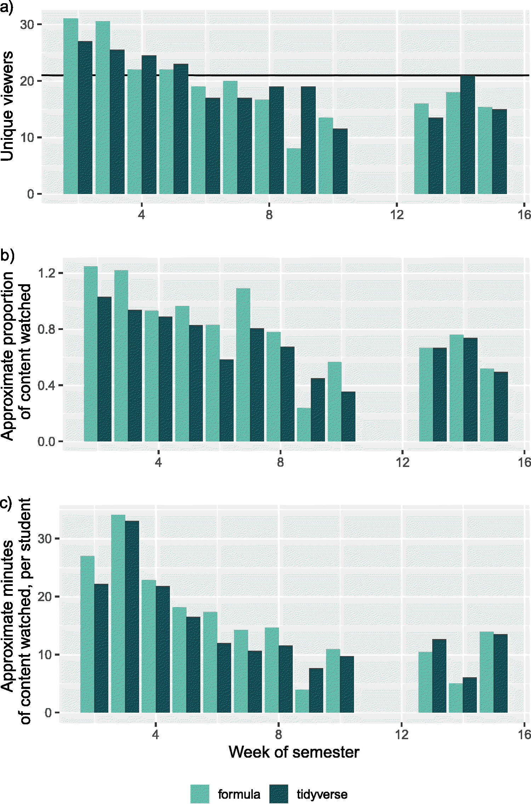

***Your Result:***


***Match:*** ☑ Yes ☐ Close ☐ No

**Figure 5:**

***Paper:***

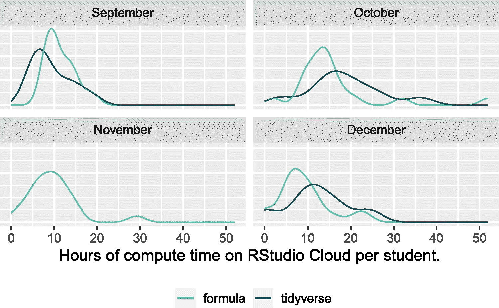

***Your Result:***

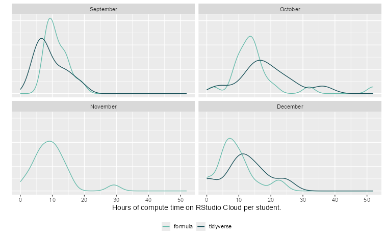

***Match:*** ☑ Yes ☐ Close ☐ No

**Figure 6:**

***Paper:***

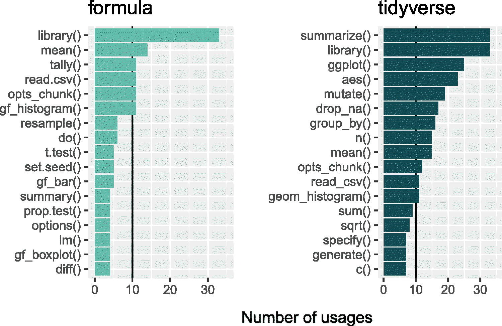

***Your Result:***

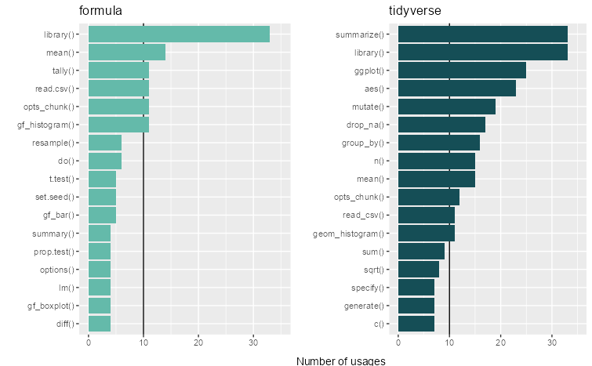

***Match:*** ☑ Yes ☐ Close ☐ No

------------------------------------------------------------------------

### 6.3 Sensitivity Checks

**Are figures sensitive to different perturbations?**

Test the robustness of key results:

| What You Varied | Sensitive? | Notes |
|------------------|------------------|-----------------------------------|
| Random seed | ☐ Yes ☑ No | Figures didn't change if seed changes. |
| Data preprocessing | ☐ Yes ☑ No | Figures and tables didn't change if `filter(!is.na(_))` was used instead of `drop.na(_)`. |
| Parameter values | ☐ Yes ☑ No | Means and differences didn't change in the events of seed changes or different data preprocessing. |

------------------------------------------------------------------------

## Part 7: Issues Log

**FILL THIS OUT AS YOU GO - Don't wait until the end!**

**Issue Types:** - **Data:** missing, inaccessible, format issues, size mismatch - **Code:** errors, missing functions, package issues, version conflicts - **Methods:** ambiguous description, parameters not specified, unclear preprocessing

**Impact Scale:** - **High:** Prevents reproduction or changes main conclusions - **Medium:** Affects numerical results but not overall findings - **Low:** Minor cosmetic differences

### 7.1 Problems Encountered

| \# | Type | Description | Impact | How You Handled It | Status |
|------------|------------|------------|------------|------------|------------|
| 1 | Methods | Got a warning for a missing font (figure 4). | Low | I changed the font used from "CM Roman" to "Arial". | Resolved |
| 2 | Methods | Get a warning for `:::` appearing in the document whenever I preview the paper. | Low | I tried downloading the "rtickle" package because it references `rticles: asa_article` but it didn't work. | Open |
| 3 | Code | Got an error saying "Could not find associated project in working directory or any parent directory. | Low | Changed `here::i_am("PaperDraft.Rmd")` in code block 2 to `here::i_am("paper/Reproduced_PaperDraft.Rmd")` | Resolved |
| 3 | Code | Code block 14 and 57 wasn't registered as a code block, causing some code to not run. | Medium | I deleted the single quote (\`) in the YAML line that caused the issue. | Resolved |

**Impact Summary**:

Other than not being able to find the right file. None of the errors I experiences affected the results of the figures, it just impacted how the document itself looked.

------------------------------------------------------------------------

### 7.2 Key Assumptions You Made

List every assumption you made during reproduction:

| \# | Assumption | Why You Made It | Impact | How You Checked It |
|---------------|---------------|---------------|---------------|---------------|
| 1 | Folder/directory structure matches | The paper expected matching directories in order to function properly (here package) | Low - not to difficult to fix. | I ran the code and fixed errors on the way. |
| 2 | Package version are compatible | The paper didn't specify the package versions. | High - Didn't impact me currently. | I had no choice but to hope I was using the right package version. Thankfully, this paper is recent. |
| 3 | Preprocessing choices are valid | The professor did all the preprocessing for me, so I imagined it would still work. | Medium - If changed, maybe would get different results or errors. | I tried changing the `drop.na()`'s in the paper but it didn't change anything. I imagine other changes might result in errors if not done properly. |
| 4 | Fixed student counts. | Lots of preprocessing and mutations expected 21 students in one section and 20 in the other, which were explicitly stated in the code. | High | I played with the code and got slightly different results when I changed the sample sizes. |

------------------------------------------------------------------------

## Part 8: Final Reproducibility Assessment

### 8.1 Overall Reproducibility Score

**Your Score: *10*/10**

**Scoring Guide:** - **9-10:** Near-exact replication - all main results match within rounding - **7-8:** Close match - minor numerical differences, same conclusions - **5-6:** Partial match - general trends match, some specifics differ - **3-4:** Poor match - substantial differences in results - **0-2:** Non-reproducible - major barriers, couldn't replicate findings

**Justification for your score:**

**What matched:** - ☐ Main statistical results (coefficients, p-values, etc.) - ☑ Figures show same patterns/trends - ☑ Tables show same conclusions - ☐ Sample sizes match - ☐ Effect sizes are similar

**What didn't match:** - ☐ Some numerical values differ - ☐ Confidence intervals differ - ☐ Some figures differ - ☐ Sample sizes differ - ☐ Other: \_\_\_

------------------------------------------------------------------------

### 8.2 Reproducibility Summary

**What made reproduction easier:**

The author was kind enough to have literally all of their code for everything in a GitHub that was easy to access. they also included READMEs which helped me find what I needed in the GitHub.

**What made reproduction harder:**

The author had very specific style choices and didn't explicitly say what versions the packages were for the analysis.

**What could the authors have done better:**

List the packages used and their versions. Also, don't assume everyone has downloaded or wants to download extra font sizes to their computer.

**Advice for future reproducers of this paper:**

Download the entire github, since the `here` package is used. It will make it more likly that the paper runs on the first try.

------------------------------------------------------------------------

## Part 9: Computational Environment

**Document your complete environment:**

``` r
# For R users:
sessionInfo()

# Paste output here:
<!--
R version 4.5.1 (2025-06-13 ucrt)
Platform: x86_64-w64-mingw32/x64
Running under: Windows 11 x64 (build 26200)

Matrix products: default
  LAPACK version 3.12.1

locale:
[1] LC_COLLATE=English_United States.utf8  LC_CTYPE=English_United States.utf8    LC_MONETARY=English_United States.utf8
[4] LC_NUMERIC=C                           LC_TIME=English_United States.utf8    

time zone: America/Los_Angeles
tzcode source: internal

attached base packages:
[1] stats     graphics  grDevices utils     datasets  methods   base     

other attached packages:
 [1] infer_1.1.0          mosaicData_0.20.4    ggformula_1.0.1      lattice_0.22-7       palmerpenguins_0.1.1 knitr_1.50          
 [7] readxl_1.4.5         extrafont_0.20       cowplot_1.2.0        ggh4x_0.3.1          bookdown_0.46        broom.mixed_0.2.9.7 
[13] lme4_1.1-37          Matrix_1.7-3         kableExtra_1.4.0     lubridate_1.9.4      forcats_1.0.1        stringr_1.5.2       
[19] dplyr_1.1.4          purrr_1.2.2          readr_2.1.5          tidyr_1.3.1          tibble_3.3.0         ggplot2_4.0.2       
[25] tidyverse_2.0.0      here_1.0.2          

loaded via a namespace (and not attached):
 [1] Rdpack_2.6.4            rlang_1.2.0             magrittr_2.0.4          furrr_0.4.0             ggridges_0.5.7          compiler_4.5.1         
 [7] mosaic_1.9.2            systemfonts_1.3.1       vctrs_0.7.3             pkgconfig_2.0.3         crayon_1.5.3            fastmap_1.2.0          
[13] backports_1.5.0         labeling_0.4.3          utf8_1.2.6              rmarkdown_2.30          tzdb_0.5.0              haven_2.5.5            
[19] nloptr_2.2.1            ragg_1.5.0              bit_4.6.0               xfun_0.53               cachem_1.1.0            labelled_2.16.0        
[25] jsonlite_2.0.0          broom_1.0.10            parallel_4.5.1          R6_2.6.1                bslib_0.9.0             stringi_1.8.7          
[31] RColorBrewer_1.1-3      parallelly_1.45.1       boot_1.3-31             extrafontdb_1.1         jquerylib_0.1.4         cellranger_1.1.0       
[37] Rcpp_1.1.0              splines_4.5.1           timechange_0.3.0        tidyselect_1.2.1        rstudioapi_0.17.1       codetools_0.2-20       
[43] listenv_0.9.1           withr_3.0.2             S7_0.2.0                evaluate_1.0.5          future_1.70.0           xml2_1.4.0             
[49] pillar_1.11.1           reformulas_0.4.2        generics_0.1.4          vroom_1.6.6             rprojroot_2.1.1         hms_1.1.3              
[55] scales_1.4.0            minqa_1.2.8             globals_0.19.1          glue_1.8.0              gdtools_0.5.0           tools_4.5.1            
[61] ggiraph_0.9.6           grid_4.5.1              Rttf2pt1_1.3.14         rbibutils_2.3           nlme_3.1-168            cli_3.6.5              
[67] textshaping_1.0.3       fontBitstreamVera_0.1.1 viridisLite_0.4.2       svglite_2.2.2           mosaicCore_0.9.5        gtable_0.3.6           
[73] sass_0.4.10             digest_0.6.37           fontquiver_0.2.1        htmlwidgets_1.6.4       farver_2.1.2            htmltools_0.5.8.1      
[79] lifecycle_1.0.4         fontLiberation_0.1.0    bit64_4.6.0-1           MASS_7.3-65    
-->
```

``` python
# For Python users:
import sys
print(sys.version)
# pip list or conda list

# Paste output here:
```

------------------------------------------------------------------------

## Part 10: Your Reproduction Materials

**Where are your materials located?**

-   Repository link: <https://github.com/malfaro2/ReproStatsLab/tree/main>
-   Branch/folder: \_\_\_
-   README included? ☐ Yes ☑ No

**What you're sharing:** - ☐ Your code (well-commented) - ☑ This completed template - ☑ Output figures/tables - ☐ Data (if shareable) - ☑ Notes on issues encountered

------------------------------------------------------------------------

## Template Information

**Version:** 2.0\
**Date:** December 2025\
**Your Name:** Sharry Eydel\
**Time Spent on Reproduction:** Approximately 6 hours\
**Completion Date:** 29 April 2026

------------------------------------------------------------------------

**Final Reminder:**

Reproducibility is challenging! The goal isn't perfection - it's understanding. Document thoroughly, be honest about limitations, and remember that your efforts help advance open science.

If results don't match exactly, that's valuable information. Understanding *why* they differ is often more important than getting a perfect match.