# Paper Reproduction Walkthrough Template

## Overview

This template guides you through the process of reproducing a statistical research paper. Fill this out as you work through your reproduction - it serves as both your workflow guide and your final report.

**Important:** As you encounter issues during reproduction, immediately document them in the **Issues Log** (Part 7). Don't wait until the end!

------------------------------------------------------------------------

## Part 1: Initial Paper Scan

### 1.1 Basic Information

| Field | Information |
|------------------------------------------|------------------------------|
| **Title** | Regression, Transformations, and Mixed-Effects with Marine Bryozoans |
| **Authors** | Ciaran Evans |
| **Year** | 2022 |
| **Journal** | Journal of Statistics and Data Science Education |
| **DOI** | 10.1080/26939169.2022.2074923 |
| **Your Name** | Sharry Eydel |
| **Date Started** | May 20, 2026 |

### 1.2 Quick Assessment

**What is this paper about?** (1-2 sentences)

This paper shows how data from a marine bryozoan study can be used to teach regression, log transformations, repeated measures, and mixed-effects models. The dataset connects biological questions about offspring size, metabolic rate, and energy efficiency to practical statistical modeling choices.

**Is data available?** ☑ Yes ☐ Partial ☐ No

**Is code available?** ☑ Yes ☐ Partial ☐ No

**Are statistical methods clearly stated?** ☑ Yes ☐ Somewhat ☐ No

------------------------------------------------------------------------

## Part 2: GO/NO-GO Decision

### Decision Tree

```         
1. Is ANY data available?
   - NO -> STOP (cannot reproduce without data)
   - YES -> Continue to #2

2. Is code available OR are methods clearly described?
   - NO -> STOP (too difficult to reproduce)
   - YES -> Continue to #3

3. Do you have the skills/time to reproduce this?
   - NO -> STOP (consider a different paper)
   - YES -> PROCEED WITH REPRODUCTION
```

### Your Decision

**Will you proceed?** ☑ Yes ☐ No

**Reproduction type:** - ☑ Full reproduction (data + code available) - ☐ Computational reproduction (data available, writing own code) - ☐ Partial reproduction (some data/code missing)

**Why this decision?**

I will proceed because the article states that the raw and corrected bryozoan data, research-paper activity, and all analysis code are available in the supplementary materials. The local supplementary materials include the raw data, cleaned data, corrected cleaned data, an HTML activity, and an R script that performs the data wrangling and analyses discussed in the paper. The statistical methods are also described clearly enough to follow: the paper builds from exploratory data analysis and simple regression to log-log regression, multiple regression, and mixed-effects models for experimental runs.

------------------------------------------------------------------------

## Part 3: Understanding the Paper

### 3.1 Abstract & Research Question

**Abstract summary (3-5 sentences):**

This article presents a real biological dataset as a teaching case for regression and data analysis. The data come from a study of two marine bryozoan species, *Bugula neritina* and *Watersipora subtorquata*, where researchers measured offspring mass and metabolic rate across developmental stages and experimental runs. Evans explains how the dataset can support introductory topics such as data wrangling, visualization, regression assumptions, and log transformations, while also extending naturally to advanced topics such as repeated measures and mixed-effects models. The main statistical idea is that a log-log model lets students study metabolic scaling and test whether larger offspring use proportionally less energy than smaller offspring.

**Main research question(s):**

1.  How can the bryozoan mass and metabolic-rate data be used to teach regression concepts across introductory and advanced statistics courses?
2.  What modeling choices are needed to analyze the relationship between offspring mass and metabolic rate?
3.  Does metabolic rate scale allometrically with mass, suggesting that larger offspring are more energy efficient relative to their size?
4.  How should dependence from experimental runs and repeated measurements across developmental stages be handled statistically?

**Key findings:**

-   The bryozoan data is useful pedagogically because they require meaningful data wrangling, visualization, transformation, and model checking.
-   A simple linear model on the raw scale can show that larger organisms use more absolute energy, but it cannot fully address proportional energy efficiency.
-   Log-transforming both mass and metabolic rate gives a log-log regression model where the slope is the metabolic scaling exponent.
-   Slopes below 1 support the biological interpretation that larger offspring use proportionally less energy relative to their size.
-   Mixed-effects models are appropriate because observations vary by experimental run, and some individuals are measured repeatedly across developmental stages.

### 3.2 Statistical Methods Used

List the main statistical methods (you'll understand these better as you reproduce):

| Method | Brief Description | Used For |
|-------------------|---------------------------------|--------------------|
| Exploratory data analysis | Boxplots and scatterplots of mass and metabolic rate by species, stage, and run | Understand distributions, detect data issues, and motivate modeling choices |
| Data wrangling | Reshaping raw species-specific columns into one tidy dataset and correcting a data error | Prepare the supplementary data for analysis |
| Simple linear regression | Model metabolic rate as a function of mass on the original scale | Assess whether larger offspring use more absolute energy |
| Log-log linear regression | Model log(metabolic rate) as a function of log(mass) | Estimate the metabolic scaling exponent and test whether it is less than 1 |
| Multiple regression with interactions | Include species, developmental stage, log mass, and species-by-stage terms | Compare metabolic relationships across species and stages |
| Model diagnostics | Residual plots and Q-Q plots | Check linear regression and mixed-model assumptions |
| Mixed-effects models | Linear mixed models with experimental run as a random effect, and later random slopes | Account for correlation and between-run variability |
| Likelihood ratio and simulation-based tests | Compare models with and without random effects | Test whether random-effect variance improves the model |
| Parametric bootstrap confidence intervals | Bootstrap intervals for mixed-model slope estimates | Quantify uncertainty for the metabolic scaling exponent |

------------------------------------------------------------------------

## Part 4: Data Assessment

### 4.1 Data Inventory

**How many datasets does the paper use?** 3

For each dataset, fill out a table:

**Dataset 1:**

| Aspect | Details |
|------------------------------------|------------------------------------|
| **Dataset name** | bryozoan_raw |
| **Description** | Has the stage, run(?), log10 age, and log10 metabolic rate of both Bugula and Watersipora. |
| **Sample size (n)** | 534 (rows, 568 individuals) |
| **Number of variables** | 8 |
| **Available?** | ☑ Yes ☐ Partial ☐ No |
| **Source/Location** | Supplementary Materials of Paper |
| **DOI/Link** | <https://doi.org/10.1080/26939169.2022.2074923> |
| **Format** | CSV |

**Dataset 2:**

| Aspect | Details |
|------------------------------------|------------------------------------|
| **Dataset name** | bryozoan_data |
| **Description** | Describes the species/type of bryozoan, along with information such as run, stage, mass, and metabolic. The original authors made an error (that they since fixed but this author wanted to keep the error to teach data cleaning) of putting the metabolic rate number in the "late" stage rows of the mass column. |
| **Sample size (n)** | 823 |
| **Number of variables** | 5 |
| **Available?** | ☑ Yes ☐ Partial ☐ No |
| **Source/Location** | Supplementary Materials of Paper |
| **DOI/Link** | <https://doi.org/10.1080/26939169.2022.2074923> |
| **Format** | CSV |

**Dataset 3:**

| Aspect | Details |
|------------------------------------|------------------------------------|
| **Dataset name** | bryozoan_data_fixed |
| **Description** | Same as bryozoan_data, but they fixed the error of the metabolic rate appearing in the mass column by replacing them with the mass measurements during from the "early" stages of those algae. |
| **Sample size (n)** | 823 |
| **Number of variables** | 5 |
| **Available?** | ☑ Yes ☐ Partial ☐ No |
| **Source/Location** | Supplementary Materials of Paper |
| **DOI/Link** | <https://doi.org/10.1080/26939169.2022.2074923> |
| **Format** | CSV |

------------------------------------------------------------------------

### 4.2 Data Wrangling & Preprocessing

**What did the authors do to prepare the data?**

For each dataset, document the authors' data cleaning steps:

**Dataset 1 - Preprocessing:**

No preprocessing is done for dataset 1 in this paper.

**Final sample size:** - Paper reports: n = Not stated ***- You obtained: n =*** 536 - Match? ☐ Yes ☐ No ☑ Unsure

**Dataset 2 and 3 - Preprocessing:**

| Step | Details/Notes |
|-----------------------|------------------------------------------------|
| 1\. Make new tables for each species of algae | The author makes two new tables to hold all the information of run, stage, mass, and metabolic for each species. They then add a species column for both. |
| 2\. Remove NA's and combine tables (makes dataset 2) | The author combines these tables, and remove missing values. |
| 3\. Fix mass column (makes dataset 3) | The author replaces the incorrect mass entries (they contain the metabolic rate and are all less than 1) with the mass entries of the same algae during their "early" stage. |

**Your data preparation:**

| Step | What You Did | Matches Paper? | Notes |
|------------------|------------------|------------------|------------------|
| 1\. | Make new tables for each species of algae | ☑ Yes ☐ No ☐ Unclear | None |
| 2\. | Remove NA's and combine tables | ☑ Yes ☐ No ☐ Unclear | None |
| 3\. | Fix mass column | ☑ Yes ☐ No ☐ Unclear | I also downloaded all three data files just in case. |

**Final sample size:** - Paper reports: n = 823 (568 individuals) ***- You obtained: n =*** 823 (568 individuals) - Match? ☑ Yes ☐ No

------------------------------------------------------------------------

## Part 5: Code Assessment

### 5.1 Code Availability

**Is code available?** ☑ Fully ☐ Partially ☐ Not at all

**If yes, where?** Supplemental Materials zip at the bottom or top of the article

**Programming language(s):** ☑ R ☐ Python ☐ Other: \_\_\_

------------------------------------------------------------------------

### 5.2 Software Environment

**R/Python Version Information:**

| Software | Author's Version | Your Version    |
|----------|------------------|-----------------|
| R/Python | Not Specified    | R version 4.5.1 |
| IDE      | Not Specified    | RStudio 0.1.249 |

**Required Packages/Libraries:**

| Package   | Author's Version | Your Version | Available? | Installation Issues? |
|---------------|---------------|---------------|---------------|---------------|
| tidyverse | Not Specified    | 2.0.0        | ☑ Yes ☐ No | None                 |
| lme4      | Not Specified    | 1.1-37       | ☑ Yes ☐ No | None                 |
| lmerTest  | Not Specified    | 3.1-3        | ☑ Yes ☐ No | None                 |
| RLRsim    | Not Specified    | 3.1-9        | ☑ Yes ☐ No | None                 |
| latex2exp | Not Specified    | 0.9.8        | ☑ Yes ☐ No | None                 |
| patchwork | Not Specified    | 1.3.2        | ☑ Yes ☐ No | None                 |
| xtable    | Not Specified    | 1.8-8        | ☑ Yes ☐ No | None                 |
| dplyr     | Not Specified    | 1.1.4        | ☑ Yes ☐ No | None                 |
| ggplot2   | Not Specified    | 4.0.2        | ☑ Yes ☐ No | None                 |

------------------------------------------------------------------------

### 5.3 Code Functionality Check

**Fill this out as you run the code:**

| Code Section | Purpose | Runs Successfully? | Errors Encountered | How You Fixed It |
|---------------|---------------|---------------|---------------|---------------|
| Data loading and cleaning | Reorganize the data and remove any missing values. | ☑ Yes ☐ No ☐ Partial | 1 | Rewrote the read_csv line of code for my current directory. |
| Figure 1 | Visualize the error in the Mass column of the data before it gets fixed. | ☑ Yes ☐ No ☐ Partial | 0 | N/A |
| Fix the errors | Fix the errors so the distribution is more logical and later visualization work better. | ☑ Yes ☐ No ☐ Partial | 0 | N/A |
| Figure 2 | Depicts the variability of mass and metabolic rate by species. | ☑ Yes ☐ No ☐ Partial | 0 | N/A |
| Figure 3 | Depicts the technical variability, aka the variability between runs. | ☑ Yes ☐ No ☐ Partial | 0 | N/A |
| Subsetting the data and fitting a simple linear regression model | To make a prediction on the metabolic rate based on mass. | ☑ Yes ☐ No ☐ Partial | 0 | N/A |
| Figure 4 | Check if our data meets the assumptions needed for linear regression | ☑ Yes ☐ No ☐ Partial | 0 | N/A |
| Figure 5 | Visualize possible graphs for the relationship between mass and metabolism. | ☑ Yes ☐ No ☐ Partial | 0 | N/A |
| Log-model and it's statistics | Completes the log-model and finds the Confidence Interval (CI) and p-value. | ☑ Yes ☐ No ☐ Partial | 0 | N/A |
| Multiple Regression | Completes the multiple variable regression and compares models to find the best one. | ☑ Yes ☐ No ☐ Partial | 0 | N/A |
| Figure 6 | Compares log mass and log metabolic rate for early and late stage algae for both species. | ☑ Yes ☐ No ☐ Partial | 0 | N/A |
| Mixed Effects modeling | Runs tests and model for mixed effects. | ☑ Yes ☐ No ☐ Partial | 0 | N/A |
| Figure 7 | Check assumptions of the model | ☑ Yes ☐ No ☐ Partial | 0 | N/A |
| Table 1 | Finds the estimated coefficients, t-value, and standard error for each effect. | ☑ Yes ☐ No ☐ Partial | 0 | N/A |

------------------------------------------------------------------------

### 5.4 Random Seeds & Reproducibility

**Does the paper specify random seeds?** ☑ Yes (seed = 3) ☐ No

**Your approach:** - If paper specifies seed: Use it - If not: Document your seed = \_\_\_

**Seed sensitivity check:**

param_boot(ble_lme): (0.5314853, 0.821162) about (0.53, 0.82)

param_boot(ble_lme_2): (0.5090424, 0.8297162) about (0.51, 0.83)

| Seed Value | boot lmer CI | boot lmer_2 CI | Notes |
|----|----|----|----|
| 123 | (0.536115, 0.8204729) | (0.5142632, 0.8329562) | Rounded to 2 decimal places, the results match. |
| 456 | (0.5308137, 0.8213556) | (0.5158518, 0.8324485) | Rounded to 2 decimal places, the results match. |
| 789 | (0.5313683, 0.8235829) | (0.5113949, 0.8314797) | Rounded to 2 decimal places, the results match. |

**Are results stable across seeds?** ☐ Yes ☐ No ☑ Somewhat

------------------------------------------------------------------------

## Part 6: Figure & Table Reproduction

### 6.1 Figures/Tables Inventory

List all figures and tables you're attempting to reproduce:

| Figure/Table | Description | Code Available? | Attempted? | Reproducible? | Results Match? |
|------------|------------|------------|------------|------------|------------|
| Figure 1 | Distributions of bryozoan mass and metabolic rate by species and stage in the original (uncorrected) data. | ☑ Yes ☐ No ☐ Partial | ☑ Yes ☐ No | ☑ Yes ☐ No | ☑ Yes ☐ Mostly ☐ No |
| Figure 2 | Relationship between mass and metabolic rate for marine bryozoans by species and stage, in the corrected data.Di | ☑ Yes ☐ No ☐ Partial | ☑ Yes ☐ No | ☑ Yes ☐ No | ☑ Yes ☐ Mostly ☐ No |
| Figure 3 | Distribution of metabolic rate for each run in the study, by species and stage. | ☑ Yes ☐ No ☐ Partial | ☑ Yes ☐ No | ☑ Yes ☐ No | ☑ Yes ☐ Mostly ☐ No |
| Figure 4 | Residual and Normal QQ plots for linear regression of metabolic rate on mass in the early-stage *Bugula*. | ☑ Yes ☐ No ☐ Partial | ☑ Yes ☐ No | ☑ Yes ☐ No | ☑ Yes ☐ Mostly ☐ No |
| Figure 5 | Possible relationship shapes between mass and metabolism, using the model (2) where: metabolic rate = 𝛼(mass\^𝛽). | ☑ Yes ☐ No ☐ Partial | ☑ Yes ☐ No | ☑ Yes ☐ No | ☑ Yes ☐ Mostly ☐ No |
| Figure 6 | Relationship between log mass and log metabolic rate for larval and early-stage bryozoans. | ☑ Yes ☐ No ☐ Partial | ☑ Yes ☐ No | ☑ Yes ☐ No | ☑ Yes ☐ Mostly ☐ No |
| Figure 7 | Diagnostic plots for the fitted model (8). The middle plot shows a normal quantile-quantile plot for the residuals $\hat{\epsilon}_{ij}$, while the plot on the right is a normal quantile-quantile plot for the estimated random effect $\hat{u}_{i}$ for each run $i$. | ☑ Yes ☐ No ☐ Partial | ☑ Yes ☐ No | ☑ Yes ☐ No | ☑ Yes ☐ Mostly ☐ No |
| Table 1 | Estimated coefficients for fixed effects in (9). | ☑ Yes ☐ No ☐ Partial | ☑ Yes ☐ No | ☑ Yes ☐ No | ☑ Yes ☐ Mostly ☐ No |

------------------------------------------------------------------------

### 6.2 Detailed Results Comparison

For key results, create detailed comparison tables:

**Figure 1:**

***Paper results:***

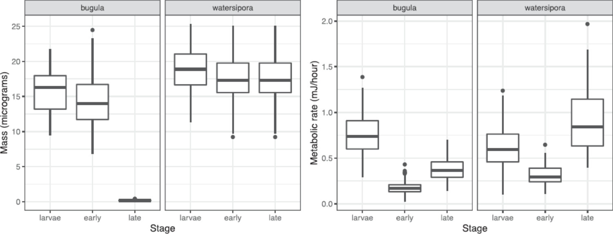

***Your results:***

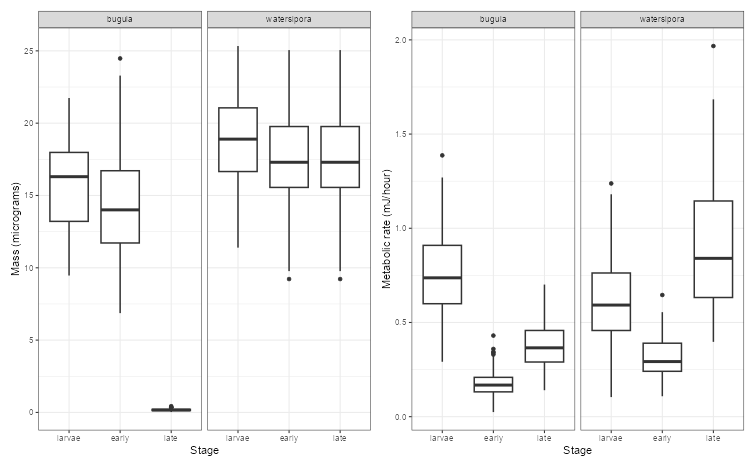

**Figure 2:**

***Paper results:***

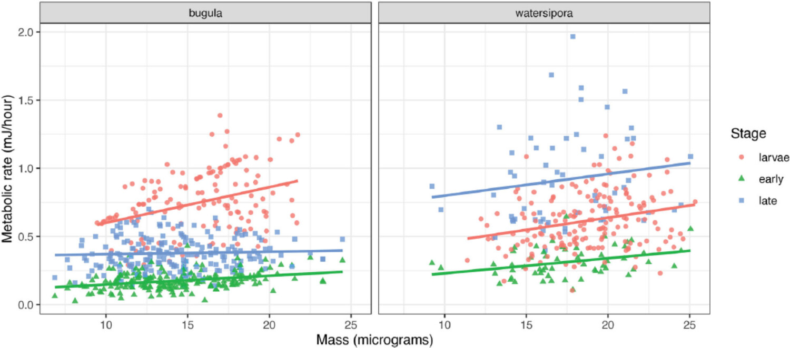

***Your results:***

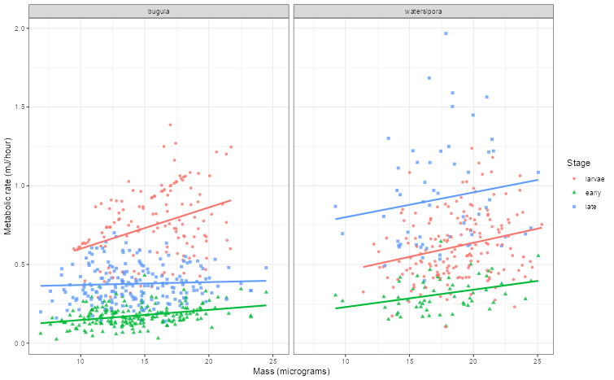

**Figure 3:**

***Paper results:***

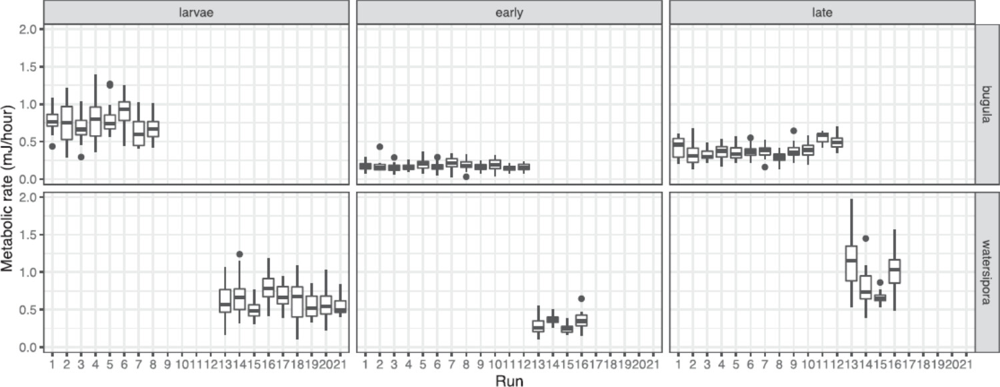

***Your results:***

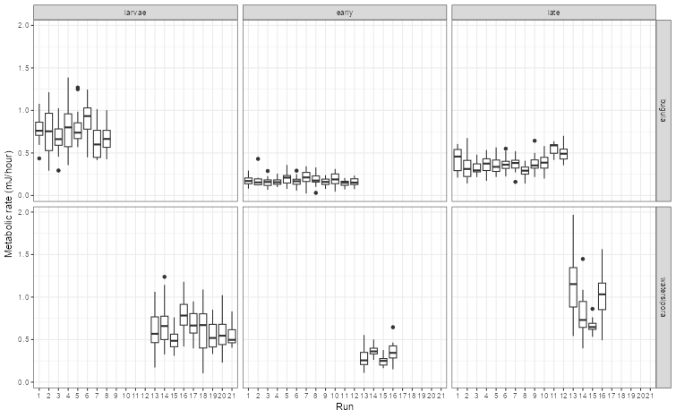

**Figure 4:**

***Paper results:***

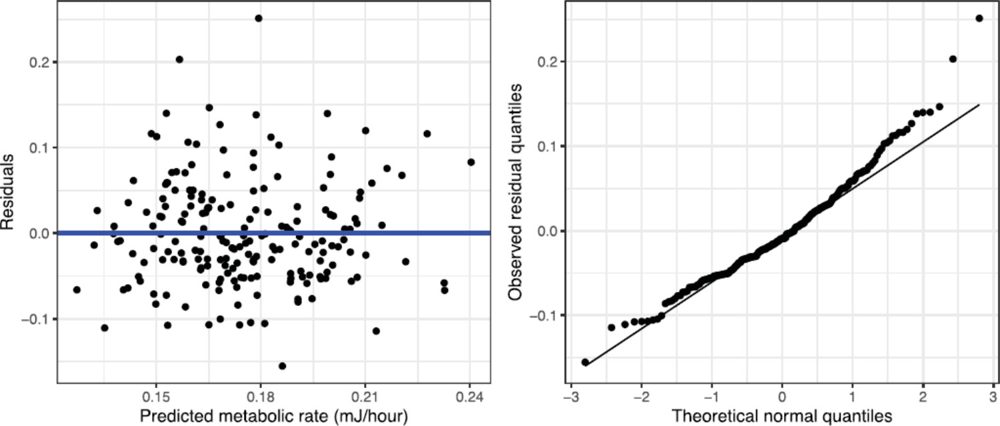

***Your results:***


**Figure 5:**

***Paper results:***

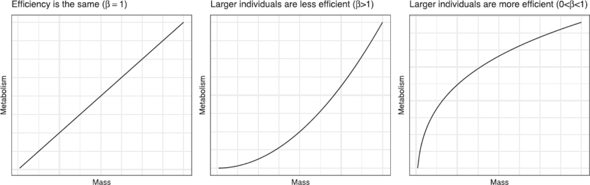

***Your results:***

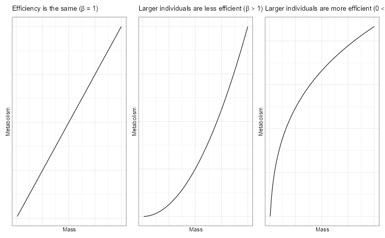

**Figure 6:**

***Paper results:***

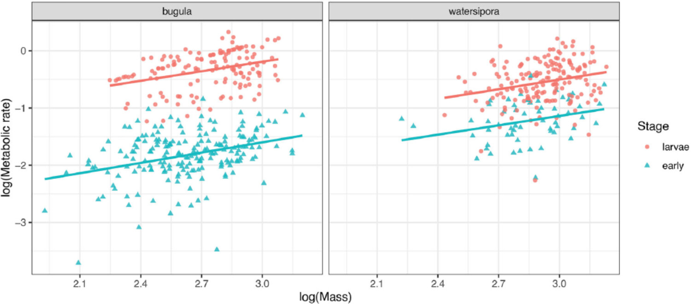

***Your results:***

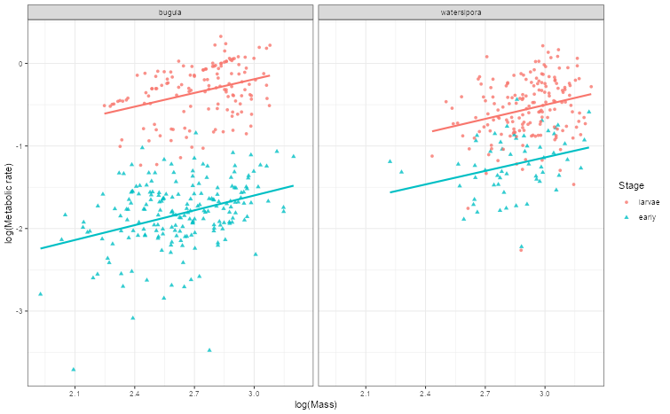

**Figure 7:**

***Paper results:***

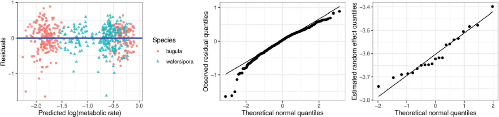

***Your results:***

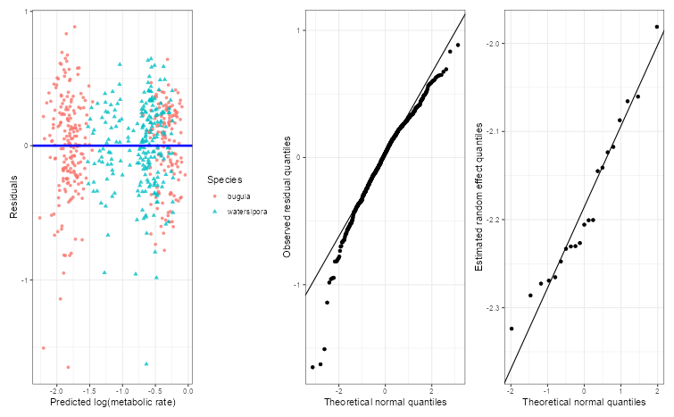

**Table 1:**

| Fixed effect | Paper \[Estimate, Standard Error, t-value\] | Your Result \[Estimate, Standard Error, t-value\] | Difference | Match? |
|---------------|---------------|---------------|---------------|---------------|
| Intercept | \[-2.18, 0.23, 0.07\] | \[-2.18, 0.23, 0.07\] | \[0,0,0\] | ☑ Yes ☐ Close ☐ No |
| Watersipora | \[-0.34, 0.07, -5.12\] | \[-0.34, 0.07, -5.12\] | \[0,0,0\] | ☑ Yes ☐ Close ☐ No |
| Early | \[-1.42, 0.04, -34.17\] | \[-1.42, 0.04, -34.17\] | \[0,0,0\] | ☑ Yes ☐ Close ☐ No |
| Watersipora\*Early | \[0.76, 0.07, 10.71\] | \[0.76, 0.07, 10.71\] | \[0,0,0\] | ☑ Yes ☐ Close ☐ No |
| log(mass) | \[0.67, 0.08, 8.38\] | \[0.67, 0.08, 8.38\] | \[0,0,0\] | ☑ Yes ☐ Close ☐ No |

------------------------------------------------------------------------

### 6.3 Sensitivity Checks

**Are figures sensitive to different perturbations?**

Test the robustness of key results:

| What You Varied | Sensitive? | Notes |
|-----------------|--------------|--------------|
| Random seed | ☑ Yes ☐ No | The results differ slightly in Bootstrap since it takes random samples. |
| Data preprocessing | ☑ Yes ☐ No | Technically yes, as errors can occur. |
| Parameter values | ☐ Yes ☑ No | Doesn't apply to this paper |

------------------------------------------------------------------------

## Part 7: Issues Log

**FILL THIS OUT AS YOU GO - Don't wait until the end!**

**Issue Types:** - **Data:** missing, inaccessible, format issues, size mismatch - **Code:** errors, missing functions, package issues, version conflicts - **Methods:** ambiguous description, parameters not specified, unclear preprocessing

**Impact Scale:** - **High:** Prevents reproduction or changes main conclusions - **Medium:** Affects numerical results but not overall findings - **Low:** Minor cosmetic differences

### 7.1 Problems Encountered

| \# | Type | Description | Impact | How You Handled It | Status |
|------------|------------|------------|------------|------------|------------|
| 1 | Code | The first line of code pulled data from the directory, but the path didn't match my directory. | High- Would be issue if cleaned versions of data wasn't available `read_csv("Paper3/Materials/bryozoan_raw.csv")` | I changed the path inside the quotes to match my directory: | Resolved |

**Impact Summary**:

Overall, little to zero issues or impact on the final results of my reproduction.

------------------------------------------------------------------------

### 7.2 Key Assumptions You Made

List every assumption you made during reproduction:

| \# | Assumption | Why You Made It | Impact | How You Checked It |
|---------------|---------------|---------------|---------------|---------------|
| 1 | The first four raw-data columns are Bugula and the last four are Watersipora. | The raw CSV is stored in two side-by-side species blocks, and the script splits columns `1:4` and `5:8`. | Medium | Checked the raw headers: `BUGULA STAGE/RUN/LOG10MASS/LOG10MR` and `WATERSIPORA STAGE/RUN/LOG10MASS/LOG10MR`. |
| 2 | The raw mass and metabolic-rate columns are log10 values that should be back-transformed with `10^x`. | The raw variable names include `LOG10MASS` and `LOG10MR`, and the analysis script uses `Mass = 10^Mass` and `Metabolic = 10^Metabolic`.The raw variable names include `LOG10MASS` and `LOG10MR`, and the analysis script uses `Mass = 10^Mass` and `Metabolic = 10^Metabolic`. | High | Compared the cleaned output to `bryozoan_data.csv` and `bryozoan_data_fixed.csv`; values are on the original microgram and mJ/hour scales. |
| 3 | Late-stage observations are repeat measurements of early-stage individuals, not new independent individuals. | The script counts individuals by filtering out `Stage == "late"` and comments that early and late counts should match within each run. | High | Checked early and late counts by species and run; the mismatch table was empty. This also explains the paper's 823 observations but 568 individuals. |

**Example:**

```         
Assumption #1: Used natural log (ln) instead of log10
Why: Paper just says "log-transformed" without specifying base
Impact: Medium - changes coefficient magnitude but not significance
Check: Tried both ln and log10 - results similar in direction/significance
```

------------------------------------------------------------------------

## Part 8: Final Reproducibility Assessment

### 8.1 Overall Reproducibility Score

\*\*Your Score: 10/10\*\*

**Scoring Guide:** - **9-10:** Near-exact replication - all main results match within rounding - **7-8:** Close match - minor numerical differences, same conclusions - **5-6:** Partial match - general trends match, some specifics differ - **3-4:** Poor match - substantial differences in results - **0-2:** Non-reproducible - major barriers, couldn't replicate findings

**Justification for your score:**

**What matched:** - ☑ Main statistical results (coefficients, p-values, etc.) - ☑ Figures show same patterns/trends - ☑ Tables show same conclusions - ☑ Sample sizes match - ☐ Effect sizes are similar

**What didn't match:** - ☐ Some numerical values differ - ☐ Confidence intervals differ - ☐ Some figures differ - ☐ Sample sizes differ - ☐ Other: \_\_\_

------------------------------------------------------------------------

### 8.2 Reproducibility Summary

**What made reproduction easier:**

After fixing the line that loaded in the data to work with my directory, everything worked without any errors. The comments also helped me know what sections of code referered to what sections of the paper. I also loved that all the necessary libraries were listed at the top of the R file.

**What made reproduction harder:**

The package versions for the packages were not listed, and not all of the libraries used in the file were properly listed at the top of the file.

**What could the authors have done better:**

List all of the packages and their versions at the top of the file.

**Advice for future reproducers of this paper:**

Fix the directory, download the libaries, and you can click run. Towards the end, the code will take a while to process due for the lines that call `bootMer`, but it will process.

------------------------------------------------------------------------

## Part 9: Computational Environment

**Document your complete environment:**

``` r
# For R users:
sessionInfo()

# Paste output here:
R version 4.5.1 (2025-06-13 ucrt)
Platform: x86_64-w64-mingw32/x64
Running under: Windows 11 x64 (build 26200)

Matrix products: default
  LAPACK version 3.12.1

locale:
[1] LC_COLLATE=English_United States.utf8  LC_CTYPE=English_United States.utf8   
[3] LC_MONETARY=English_United States.utf8 LC_NUMERIC=C                          
[5] LC_TIME=English_United States.utf8    

time zone: America/Los_Angeles
tzcode source: internal

attached base packages:
[1] stats     graphics  grDevices utils     datasets  methods   base     

other attached packages:
 [1] xtable_1.8-8    patchwork_1.3.2 latex2exp_0.9.8 RLRsim_3.1-9    lmerTest_3.1-3 
 [6] lme4_1.1-37     Matrix_1.7-3    lubridate_1.9.4 forcats_1.0.1   stringr_1.5.2  
[11] dplyr_1.1.4     purrr_1.2.2     readr_2.1.5     tidyr_1.3.1     tibble_3.3.0   
[16] ggplot2_4.0.2   tidyverse_2.0.0

loaded via a namespace (and not attached):
 [1] generics_0.1.4      stringi_1.8.7       lattice_0.22-7      hms_1.1.3     
 [5] magrittr_2.0.4      grid_4.5.1          timechange_0.3.0    RColorBrewer_1.1-3 
 [9] mgcv_1.9-3          scales_1.4.0        textshaping_1.0.3   numDeriv_2016.8-1.1
[13] reformulas_0.4.2    Rdpack_2.6.4        cli_3.6.5           crayon_1.5.3  
[17] rlang_1.2.0         rbibutils_2.3       bit64_4.6.0-1       splines_4.5.1 
[21] withr_3.0.2         parallel_4.5.1      tools_4.5.1         tzdb_0.5.0    
[25] nloptr_2.2.1        minqa_1.2.8         boot_1.3-31         vctrs_0.7.3   
[29] R6_2.6.1            lifecycle_1.0.4     bit_4.6.0           vroom_1.6.6   
[33] MASS_7.3-65         ragg_1.5.0          pkgconfig_2.0.3     pillar_1.11.1 
[37] gtable_0.3.6        glue_1.8.0          Rcpp_1.1.0          systemfonts_1.3.1 
[41] tidyselect_1.2.1    farver_2.1.2        nlme_3.1-168        labeling_0.4.3 
[45] compiler_4.5.1      S7_0.2.0 
```

------------------------------------------------------------------------

## Part 10: Your Reproduction Materials

**Where are your materials located?**

-   Repository link: <https://github.com/malfaro2/ReproStatsLab/tree/main>
-   Branch/folder: \_\_\_
-   README included? ☐ Yes ☑ No

**What you're sharing:** - ☐ Your code (well-commented) - ☑ This completed template - ☑ Output figures/tables - ☐ Data (if shareable) - ☑ Notes on issues encountered

------------------------------------------------------------------------

## Template Information

**Version:** 2.0\
**Date:** December 2025\
**Your Name:** Sharry Eydel\
**Time Spent on Reproduction:** Approximately 12 hours\
**Completion Date:** June 10, 2026

**AI Statement:**

Codex was used to complete Parts 1, 2, and 3 and was reviewed. The Codex was used in VS Code using OpenAI's extension. It was version 26.506.31421 and ChatGPT model 5.5 with Medium intelligence.

------------------------------------------------------------------------

**Final Reminder:**

Reproducibility is challenging! The goal isn't perfection - it's understanding. Document thoroughly, be honest about limitations, and remember that your efforts help advance open science.

If results don't match exactly, that's valuable information. Understanding *why* they differ is often more important than getting a perfect match.