# Paper Reproduction Walkthrough Template

## Overview

This template guides you through the process of reproducing a statistical research paper. Fill this out as you work through your reproduction - it serves as both your workflow guide and your final report.

**Important:** As you encounter issues during reproduction, immediately document them in the **Issues Log** (Part 7). Don't wait until the end!

------------------------------------------------------------------------

## Part 1: Initial Paper Scan

### 1.1 Basic Information

| Field | Information |
|-------------------------------------------|-----------------------------|
| **Title** | The Landscape of College-Level Data Visualization Courses, and the Benefits of Incorporating Statistical Thinking |
| **Authors** | Zach Branson, Monica Paz Parra, Ronald Yurko |
| **Year** | 2025 |
| **Journal** | Journal of Statistics and Data Science Education, 33(4), 390-406 |
| **DOI** | https://doi.org/10.1080/26939169.2025.2537049 |
| **Your Name** | Sharry Eydel |
| **Date Started** | May 3, 2026 |

### 1.2 Quick Assessment

**What is this paper about?** (1-2 sentences)

This paper studies how college-level data visualization courses are taught across highly ranked U.S. universities and liberal arts colleges, with special attention to whether courses are housed in statistics/data science departments and whether they include statistical topics such as inference, uncertainty, and modeling. It also argues that statistics can play a clearer role in data visualization instruction and gives teaching examples for incorporating statistical thinking into visualization courses.

**Is data available?** ☑ Yes ☐ Partial ☐ No

**Is code available?** ☑ Yes ☐ Partial ☐ No

**Are statistical methods clearly stated?** ☑ Yes ☐ Somewhat ☐ No

------------------------------------------------------------------------

## Part 2: GO/NO-GO Decision

### Decision Tree

```         
1. Is ANY data available?
   └─ NO → STOP (cannot reproduce without data)
   └─ YES → Continue to #2

2. Is code available OR are methods clearly described?
   └─ NO → STOP (too difficult to reproduce)
   └─ YES → Continue to #3

3. Do you have the skills/time to reproduce this?
   └─ NO → STOP (consider a different paper)
   └─ YES → PROCEED WITH REPRODUCTION
```

### Your Decision

**Will you proceed?** ☑ Yes ☐ No

**Reproduction type:** - ☑ Full reproduction (data + code available) - ☐ Computational reproduction (data available, writing own code) - ☐ Partial reproduction (some data/code missing)

**Why this decision?**

I will proceed because the supplementary materials provide the raw survey data, processed survey data, example datasets, and R scripts needed to reproduce the paper's results and figures. The materials are described as being available through the paper's supplementary materials/OSF repository, and for this reproduction I am treating the local `materials` folder as that supplementary-materials location. The main survey workflow is especially reproducible because `s0_prep_survey_sheets.R` creates the processed survey file from the Excel workbook, and `s1_create_survey_figures.R` creates the Section 2 summary statistics and Figures 1-4. The Section 3 example scripts are also available, although one example involving election data cannot share the original data publicly, so the overall project appears close to fully reproducible with a small limitation for that specific example.

------------------------------------------------------------------------

## Part 3: Understanding the Paper

### 3.1 Abstract & Research Question

**Abstract summary (3-5 sentences):**

The paper begins from the premise that data visualization is central to statistical practice, but that instructors may struggle to define what a college-level data visualization course should emphasize because the field is broad and interdisciplinary. The authors make two main contributions: first, they survey data visualization courses at highly ranked U.S. universities and liberal arts colleges; second, they propose teaching principles and examples for incorporating statistical thinking into visualization courses. Their survey finds that many data visualization courses are offered outside statistics and data science departments and that most courses emphasize areas such as storytelling, design, dashboards, software, or field-specific visualization rather than statistical inference. The authors argue that statistics courses can contribute a distinctive perspective by teaching students how visualization connects to uncertainty, testing, modeling, and inferential interpretation.

**Main research question(s):**

1.  How is data visualization currently taught across colleges and universities?
2.  What defining role can statistics play in teaching data visualization?

**Key findings:**

-   The authors identified 270 data visualization courses across 94 schools with data visualization offerings (135 schools were sampled).
-   Most identified courses were not taught by statistics or data science departments.
-   Many courses emphasized topics such as visual storytelling, aesthetic design, dashboards, interactive graphics, spatial data, software, and other applied visualization contexts.
-   Statistical topics were relatively uncommon: only a small number of courses covered hypothesis testing, confidence intervals, or statistical modeling.
-   The authors recommend using visualization to reinforce statistical thinking, especially by connecting graphs to uncertainty, inference, and modeling.

### 3.2 Statistical Methods Used

List the main statistical methods (you'll understand these better as you reproduce):

| Method | Brief Description | Used For |
|-------------------|---------------------------------|--------------------|
| Descriptive statistics | Counts, proportions, and cross-tabulations of schools, courses, departments, levels, URLs, and course topics. | Summarize the landscape of data visualization courses. |
| Data visualization summaries | Histograms, stacked bar charts, horizontal bar charts, and word clouds. | Reproduce Figures 1-4 summarizing number of courses, department words, level/department patterns, and topic coverage. |
| Confidence intervals for proportions (Example) | Normal-approximation intervals for estimated proportions are discussed in the paper's statistical-thinking examples. | Demonstrate how uncertainty can be incorporated into visualizations and classroom examples. |
| Linear regression with interactions (Example) | Regression models with interaction terms are used in one teaching example. | Illustrate how modeling can clarify visual patterns and comparisons. |
| Principal component analysis (PCA) (Example) | Dimension-reduction method used in an example script with the Spotify dataset. | Demonstrate visualization and interpretation of multivariate structure. |

------------------------------------------------------------------------

## Part 4: Data Assessment

### 4.1 Data Inventory

**How many datasets does the paper use?** 4

For each dataset, fill out a table:

**Dataset 1:**

| Aspect | Details |
|----------------------------------|--------------------------------------|
| **Dataset name** | DataVisualizationClassSurvey |
| **Description** | The raw dataset the authors got all their later datasets from. The first tab contains 104 colleges they surveyed, and the second tab has 50 liberal art colleges. Both tabs contain variables asking each colleges ranking in the US News 2023 ranking, their course catelog, the course's name, URL, level, depatment, topic, software, and notes. This is repeated for each course. |
| **Sample size (n)** | 154 (104 colleges; 50 liberal arts) |
| **Number of variables** | 110 |
| **Available?** | ☑ Yes ☐ Partial ☐ No |
| **Source/Location** | Open Science Framework |
| **DOI/Link** | https://osf.io/wdehn/files/e28wb |
| **Format** | Excel (.xlsx) |

**Dataset 2:**

| Aspect | Details |
|----------------------------------|--------------------------------------|
| **Dataset name** | survey_results |
| **Description** | Exactly like Dataset 1, but drops all the note columns and cleans the column names. It also combines both tabs into one big data file. |
| **Sample size (n)** | 104 |
| **Number of variables** | 110 |
| **Available?** | ☑ Yes ☐ Partial ☐ No |
| **Source/Location** | Open Science Framework |
| **DOI/Link** | https://osf.io/wdehn/files/jce7n |
| **Format** | CSV |

**Dataset 3:**

| Aspect | Details |
|----------------------------------|--------------------------------------|
| **Dataset name** | acs2015 |
| **Description** | A dataset from the American Community Survey from 2015. Basically a census done for schools. It has everything from the number of stuents who identify as certain races to their income, how they get to school, and if they're employed. |
| **Sample size (n)** | 3220 |
| **Number of variables** | 36 |
| **Available?** | ☑ Yes ☐ Partial ☐ No |
| **Source/Location** | Open Science Framework |
| **DOI/Link** | https://osf.io/wdehn/files/6tfw5 |
| **Format** | CSV |

**Dataset 4:**

| Aspect | Details |
|----------------------------------|--------------------------------------|
| **Dataset name** | spotify |
| **Description** | Contains the popularity, duration (ms), year, decade, and opinionated variables such as "dancability" of various songs. The song names or singers aren't included. |
| **Sample size (n)** | 100 |
| **Number of variables** | 13 |
| **Available?** | ☑ Yes ☐ Partial ☐ No |
| **Source/Location** | Open Science Framework |
| **DOI/Link** | https://osf.io/wdehn/files/hrm4d |
| **Format** | CSV |

------------------------------------------------------------------------

### 4.2 Data Wrangling & Preprocessing

**What did the authors do to prepare the data?**

For each dataset, document the authors' data cleaning steps:

**Dataset 1** No preprocessing was done on this dataset since it is where they put all their survey results.

**Final sample size:** - Paper reports: n = 154 - You obtained: n = 154 - Match? ☑ Yes ☐ No

**Dataset 2:**

| Step | Author's Description | Details/Notes |
|------------------|-------------------------------|-----------------------|
| 1\. Clean column names | First separate and clean the column names, then add label for file type | These changes are being done to the DataVisualizationClassSurvey dataset |
| 2\. Remove "Notes" columns | Drop the notes columns | None |
| 3\. Combine "university" and "liberal arts" tables/data | Stack and save | Saved as "my_survey_results" in data/survey data folder |

**Final sample size:** - Paper reports: n = 154 - You obtained: n = 154 - Match? ☑ Yes ☐ No

**Dataset 3:**

| Step | Author's Description | Details/Notes |
|------------------|-------------------------------|-----------------------|
| 1\. Drop 3 of the states form dataset | Now we'll filter out Alaska, Hawaii, and Puerto Rico from the acs data (just for ease of visualization) | None |
| 2\. Comute weighted means | Compute the weighted mean across counties | None |
| 3\. Make all country names lowercase | In order to match the state data, we need to convert the state name to lower case in the ACS dataset | None |
| 4\. Merges weighted means data with state data | Now we can merge the two datasets | Used "left_join" specifically. |

**Final sample size:** - Paper reports: n = Not specified - You obtained: n = 37 - Match? ☐ Yes ☐ No ☑ Maybe

**Dataset 4:**

| Step | Author's Description | Details/Notes |
|------------------|-------------------------------|-----------------------|
| 1\. Change name of "duration_ms" column | For ease of display, change "duration_ms" to just "duration" | None |
| 2\. Drop year and decades columns | First, define principal components; To do this, only focus on the 11 quantitative variables | Runs PCA afterwards. |

**Final sample size:** - Paper reports: n = Not specified - You obtained: n = 13 - Match? ☐ Yes ☐ No ☑ Maybe

**Your data preparation:**

| Step | What You Did | Matches Paper? | Notes |
|------------------|------------------|-------------------|------------------|
| 1\. | Downloaded both folders in "data" folder. | ☑ Yes ☐ No ☐ Unclear |  |
| 2\. | Unziped the files | ☑ Yes ☐ No ☐ Unclear | I downloaded them as zips but they can be downloaded individually as csv and xlsx files. |

------------------------------------------------------------------------

## Part 5: Code Assessment

### 5.1 Code Availability

**Is code available?** ☑ Fully ☐ Partially ☐ Not at all

**If yes, where?** Open Science Framework

**Programming language(s):** ☑ R ☐ Python ☐ Other: \_\_\_

------------------------------------------------------------------------

### 5.2 Software Environment

**R/Python Version Information:**

| Software | Author's Version | Your Version    |
|----------|------------------|-----------------|
| R/Python | Not Specified    | R version 4.5.1 |
| IDE      | Not Specified    | RStudio 0.1.249 |

**Required Packages/Libraries:**

| Package   | Author's Version | Your Version | Available? | Installation Issues? |
|---------------|---------------|---------------|---------------|---------------|
| ggmap     | Not Specified    | 4.0.2        | ☑ Yes ☐ No | None                 |
| maps      | Not Specified    | 3.4.3        | ☑ Yes ☐ No | None                 |
| mapproj   | Not Specified    | 1.2.12       | ☑ Yes ☐ No | None                 |
| ggthemes  | Not Specified    | 5.2.0        | ☑ Yes ☐ No | None                 |
| wordcloud | Not Specified    | 2.6          | ☑ Yes ☐ No | None                 |
| dplyr     | Not Specified    | 1.1.4        | ☑ Yes ☐ No | None                 |
| ggrepel   | Not Specified    | 0.9.8        | ☑ Yes ☐ No | None                 |
| ggbiplot  | Not Specified    | 0.6.2        | ☑ Yes ☐ No | None                 |
| tidytext  | Not Specified    | 0.4.3        | ☑ Yes ☐ No | None                 |
| SnowballC | Not Specified    | 0.7.1        | ☑ Yes ☐ No | None                 |
| tidyverse | Not Specified    | 2.0.0        | ☑ Yes ☐ No | None                 |
| janitor   | Not Specified    | 2.2.1        | ☑ Yes ☐ No | None                 |
| readxl    | Not Specified    | 1.4.5        | ☑ Yes ☐ No | None                 |
| cowplot   | Not Specified    | 1.2.0        | ☑ Yes ☐ No | None                 |
| grid      | Not Specified    | 4.5.1        | ☑ Yes ☐ No | None                 |
| gridExtra | Not Specified    | 2.3          | ☑ Yes ☐ No | None                 |
| knitr     | Not Specified    | 1.50         | ☑ Yes ☐ No | None                 |
| patchwork | Not Specified    | 1.3.2        | ☑ Yes ☐ No | None                 |

------------------------------------------------------------------------

### 5.3 Code Functionality Check

**Fill this out as you run the code:**

| Code Section | Purpose | Runs Successfully? | Errors Encountered | How You Fixed It |
|---------------|---------------|---------------|---------------|---------------|
| sandbox | Organizes and cleans the data for EDA, tables, and figures. Also creates figures 2-4. | ☑ Yes ☐ No ☐ Partial | 1 | Changed spelling error of "ame" to "name". |
| s0_prep_survey_sheets | Cleans the tables up a little more. | ☑ Yes ☐ No ☐ Partial | 0 | None |
| s1_create_survey_figures | Makes the first 4 figures of the paper to describe different counts and interesting results from the data. More consice version of sandbox. | ☑ Yes ☐ No ☐ Partial | 1 | Made a "figs" folder in my directory, and changed the path of `save_plot` to that folder. |
| barplotExample | Makes a visual example of the difference between normal visualization and statistical inference for figure 5. | ☑ Yes ☐ No ☐ Partial | 0 | None |
| densityExample | Uses spotify data to visualize density of bandwidth for figure 6. | ☑ Yes ☐ No ☐ Partial | 0 | None |
| mapsExample | Uses ACS 2015 data to make various random maps for figure 7. | ☑ Yes ☐ No ☐ Partial | 1 | Changed file path to the correct file. |
| linIntExample | Compares multiple linear regression models for unemployment rate vs voter turnout in Figure 8. | ☐ Yes ☑ No ☐ Partial | 1 | Figure 8 can't be made because they didn't provide the data. |
| pcaExample | Creates a biplot and scree plot on the spotify data to show how PCA is handled in statistic department data visualization (Figure 9). | ☑ Yes ☐ No ☐ Partial | 0 | None |

------------------------------------------------------------------------

### 5.4 Random Seeds & Reproducibility

**Does the paper specify random seeds?** ☑ Yes (seed = 123) ☐ No

**Your approach:** - If paper specifies seed: Use it - If not: Document your seed = \_\_\_

**Seed sensitivity check:**

| Seed Value | Result | Notes |
|-------------------------------|----------------------|-------------------|
| 123 | Figure 2 was slightly different than paper. | The locations of the words differed but the color and size was the same. |
| 321 | Figure 2 and 5 change slightly. | These changes are expected since the word location and coloration of the maps are randomized. |
| 543 | Figure 2 and 5 change slightly. | These changes are expected since the word location and coloration of the maps are randomized. |

**Are results stable across seeds?** ☐ Yes ☐ No ☑ Somewhat

------------------------------------------------------------------------

## Part 6: Figure & Table Reproduction

### 6.1 Figures/Tables Inventory

List all figures and tables you're attempting to reproduce:

| Figure/Table | Description | Code Available? | Attempted? | Reproducible? | Results Match? | Notes |
|-----------|-----------|-----------|-----------|-----------|-----------|-----------|
| Figure 1 | Number of data visualization classes taught within a school. | ☑ Yes ☐ No ☐ Partial | ☑ Yes ☐ No | ☑ Yes ☐ No | ☑ Yes ☐ Mostly ☐ No | None |
| Figure 2 | Word cloud displaying the top words in the department names for the 270 identified data visualization courses. All words displayed were used at least three times across department names. | ☑ Yes ☐ No ☐ Partial | ☑ Yes ☐ No | ☑ Yes ☐ No | ☐ Yes ☑ Mostly ☐ No | The size and color of the words are the same, but the locations differ slightly. |
| Figure 3 | Number of data visualization courses that were taught by statistics and/or data science departments, sorted by student-level: undergraduate-only (21.7%), graduate-only (18.8%), or both (12.7%). | ☑ Yes ☐ No ☐ Partial | ☑ Yes ☐ No | ☑ Yes ☐ No | ☑ Yes ☐ Mostly ☐ No | None |
| Figure 4 | Number of courses that cover each topic (left/a) and number of topics taught in each course (right/b) among the 256 courses for which we could identify topics, based on courses' descriptions, syllabi, or websites (if available). | ☑ Yes ☐ No ☐ Partial | ☑ Yes ☐ No | ☑ Yes ☐ No | ☑ Yes ☐ Mostly ☐ No | There are two graphs in this figure. |
| Figure 5 | Bar plots displaying proportions (0.25, 0.35, 0.4) for a single categorical variable; each y-axis is on the proportion scale. Plots on the top row display 95% confidence intervals (CIs, in black), and plots on the bottom row display Bonferroni-corrected CIs that account for all pairwise comparisions (in orange). The title of each plot also lists the p-value for a chi-squared test for equal proportions across the three categories | ☑ Yes ☐ No ☐ Partial | ☑ Yes ☐ No | ☑ Yes ☐ No | ☑ Yes ☐ Mostly ☐ No | None |
| Figure 6 | Distribution of loudness of songs, averaged within years from the 1922 to 2021. Using this dataset of 100 observations, we generated 1000 bootstrapped datasets, and computed the estimated bandwidth for each one. Displayed is the density according to the averge bandwidth (solid black), and the densities according to the lower 2.5% quantile of bandwidths (dashed orange) and upper 97.5% quantile bandwidth (dashed blue). | ☑ Yes ☐ No ☐ Partial | ☑ Yes ☐ No | ☑ Yes ☐ No | ☑ Yes ☐ Mostly ☐ No | None |
| Figure 7 | Average unemployment rate in each of the 48 contiguous United States, according to the 2015 American Community Survey. Displayed are 24 "random maps" where the data is randomly permuted across states, alongside the real map (which is in the second row, fifth column). The color coding is set such that white denotes the median unemployment rate across states (Purple is lower, Red is higher). | ☑ Yes ☐ No ☐ Partial | ☑ Yes ☐ No | ☑ Yes ☐ No | ☑ Yes ☐ Mostly ☐ No | None |
| Figure 8 | Scatterplots of municipal-level unemployment rates and voter turnout in Louisiana mayoral elections between 1988 and 2011. Points are colored and shaped by whether elections between at least one female candidate and at least one African American candidate in a given election, respectively. The only difference among the plots is how points' color and shape are mapped to the regression lines, which in turn corresponds to different statistical models. In Plot 1, no aesthetics are mapped to the regression line. In Plots 2 and 3, only the shape or color, respectively, are mapped to regression lines. In Plot 4, both shapes and color are mapped to regression lines. | ☑ Yes ☐ No ☐ Partial | ☐ Yes ☑ No | ☐ Yes ☑ No | ☐ Yes ☐ Mostly ☑ No | The data for this figure was not provided. Only the code exists. |
| Figure 9 | Biplot (left/a) and scree plot (right/b) for the spotify data. The biplot is for the top two principal components and 11 variables. The scree plot shows variance explained (y-axis) being defined as each principal component's variance divided by the sum of variances. | ☑ Yes ☐ No ☐ Partial | ☑ Yes ☐ No | ☑ Yes ☐ No | ☑ Yes ☐ Mostly ☐ No | This figure also has two graphs in it. |

------------------------------------------------------------------------

### 6.2 Detailed Results Comparison

For key results, create detailed comparison tables:

**Figure 1:**

***Paper:***

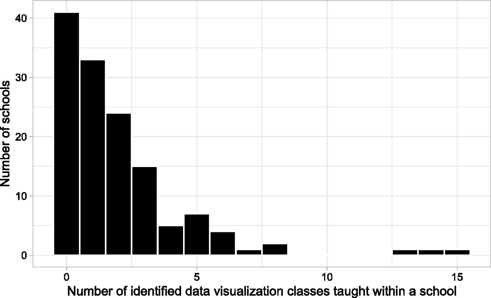{width="750"}

***Your Result:***

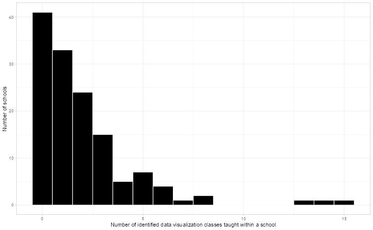{width="750"}

***Match:*** ☑ Yes ☐ Close ☐ No

**Figure 2:**

***Paper:***

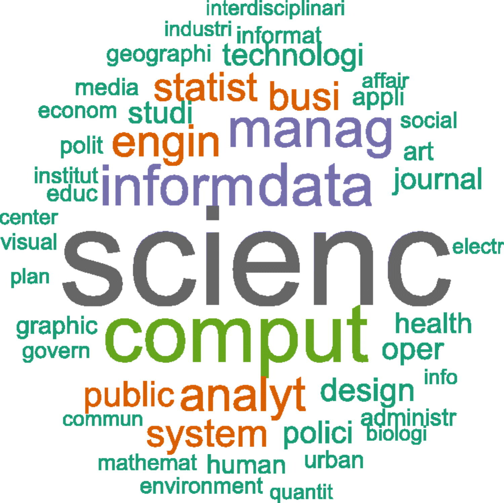{width="750"}

***Your Result:***

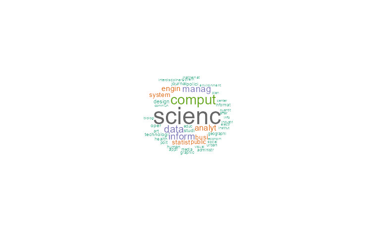{width="750"}

***Match:*** ☐ Yes ☑ Close ☐ No

**Figure 3:**

***Paper:***

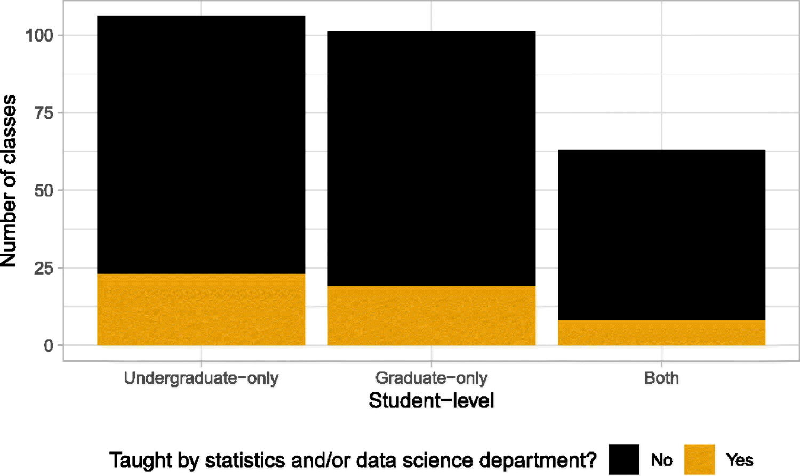{width="750"}

***Your Result:***

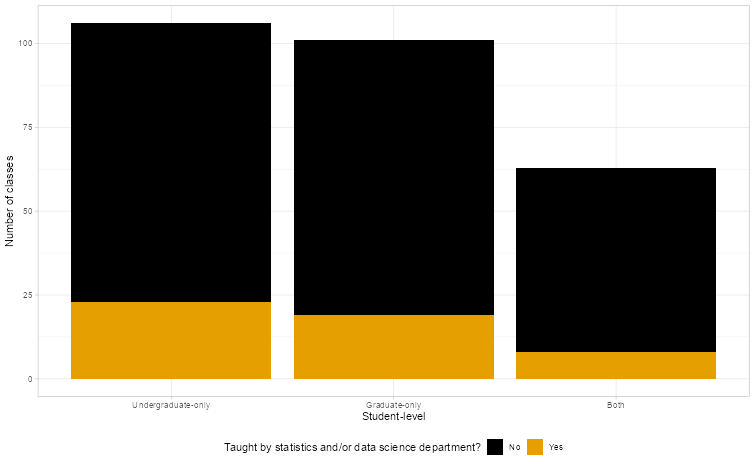{width="750"}

***Match:*** ☑ Yes ☐ Close ☐ No

**Figure 4:**

***Paper:***

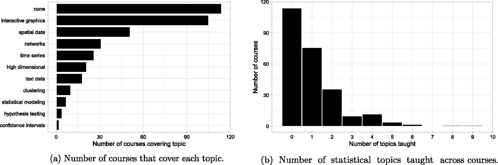{width="750"}

***Your Result:***

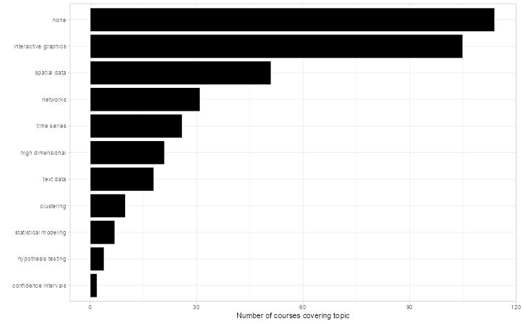{width="750"}

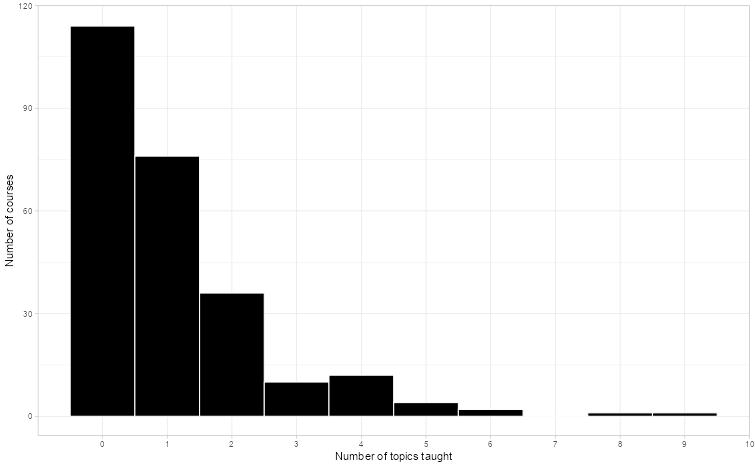{width="750"}

***Match:*** ☑ Yes ☐ Close ☐ No

**Figure 5:**

***Paper:***

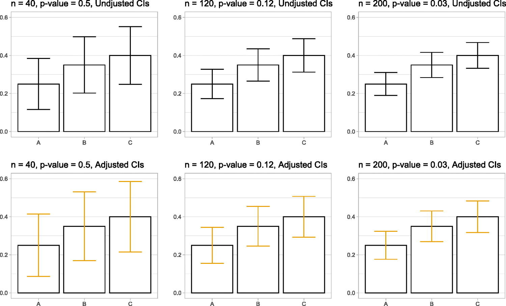{width="750"}

***Your Result:***

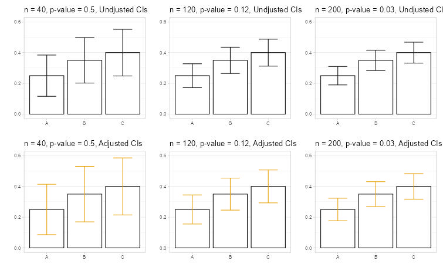{width="750"}

***Match:*** ☑ Yes ☐ Close ☐ No

**Figure 6:**

***Paper:***

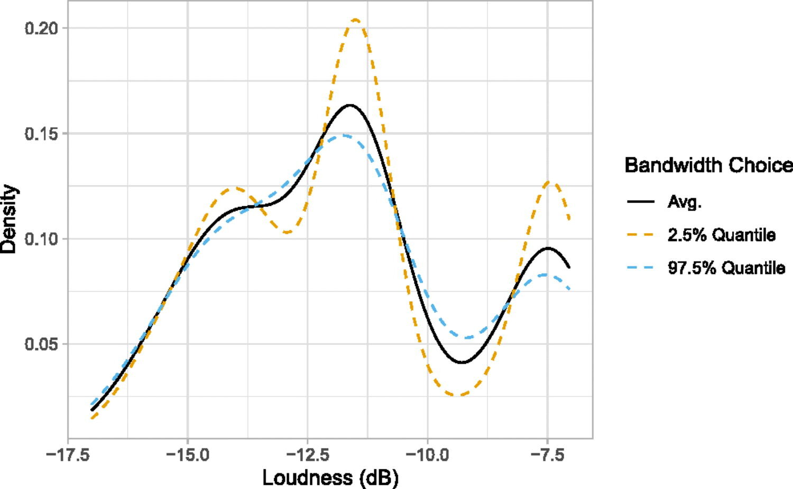{width="750"}

***Your Result:***

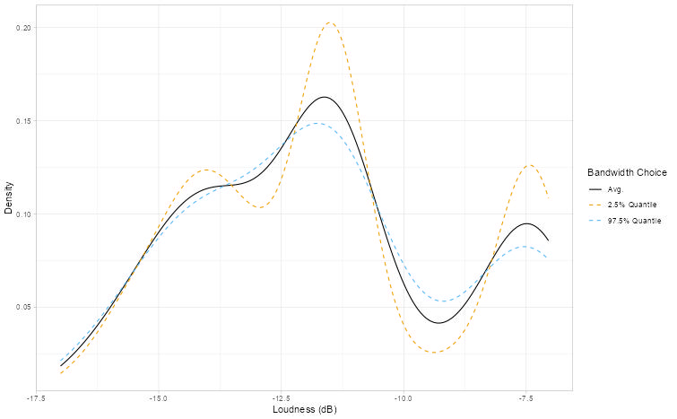{width="750"}

***Match:*** ☑ Yes ☐ Close ☐ No

**Figure 7:**

***Paper:***

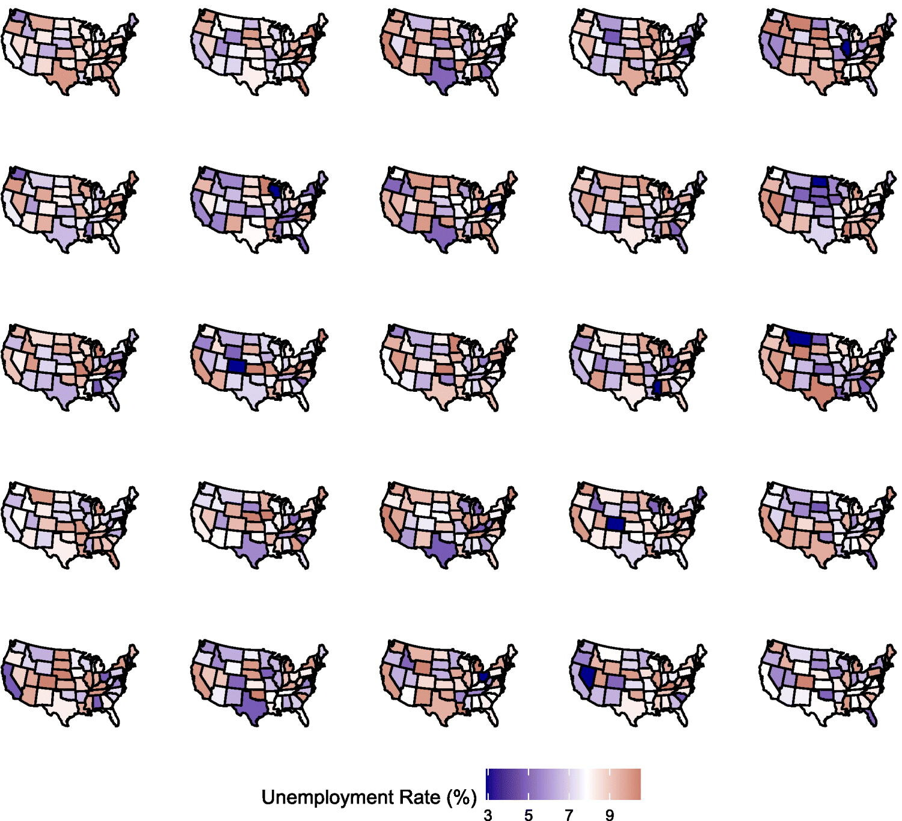{width="750"}

***Your Result:***

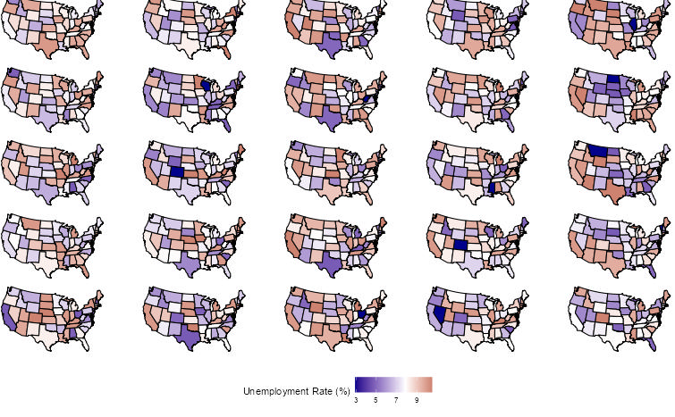{width="750"}

***Match:*** ☑ Yes ☐ Close ☐ No

**Figure 9:**

***Paper:***

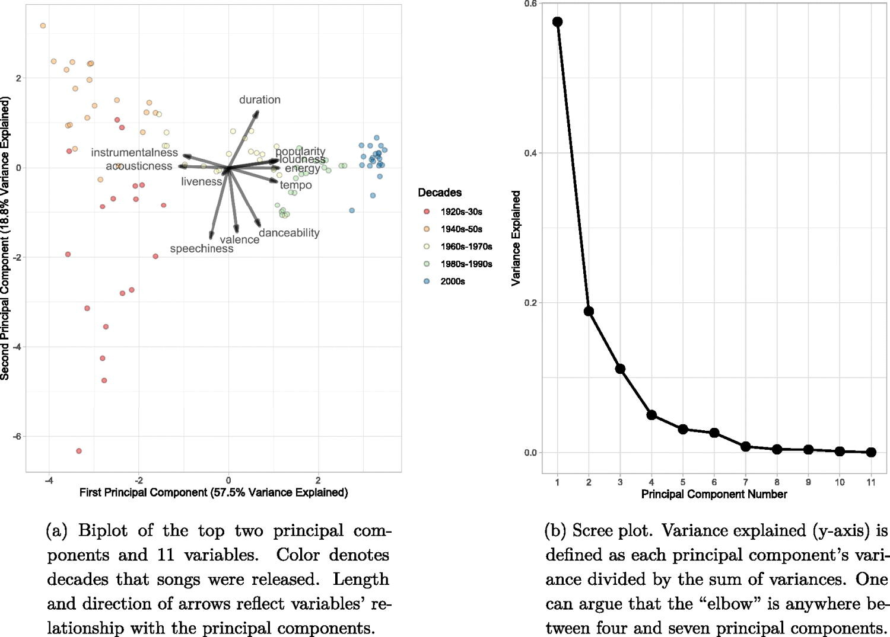{width="750"}

***Your Result:***

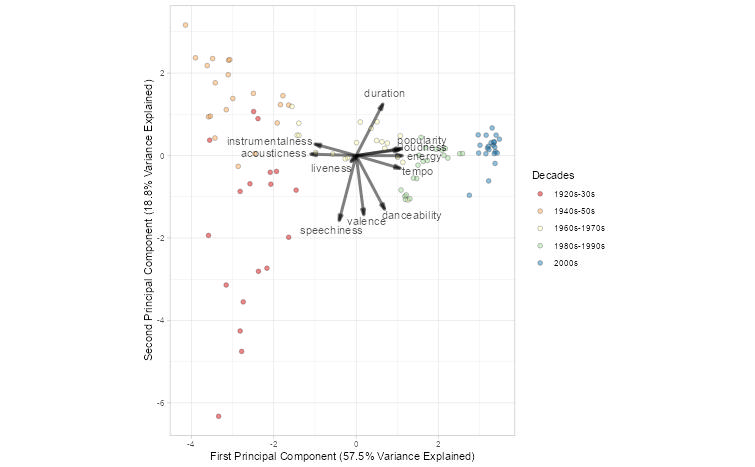{width="750"}

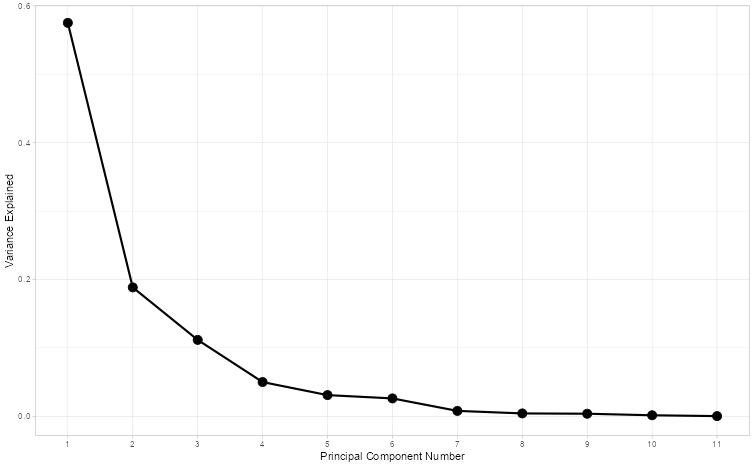{width="750"}

***Match:*** ☑ Yes ☐ Close ☐ No

**Possible reasons for differences:**

I think there was some change I made to the data cleaning process (maybe fixing the "ame" error) that led to my word cloud in Figure 2 looking slightly different than the one in the paper.

------------------------------------------------------------------------

### 6.3 Sensitivity Checks

**Are figures sensitive to different perturbations?**

Test the robustness of key results:

| What You Varied | Sensitive? | Notes |
|------------------------|------------------------|------------------------|
| Random seed | ☑ Yes ☐ No | Descriptive statistics stay the same, random based figures change (figures 2 and 5). |
| Data preprocessing | ☐ Yes ☑ No | Results don't change if preprocessing method differs, so long as the meaning of the results match the paper. |
| Parameter values | ☐ Yes ☑ No | Achieved the same p-values when seed and preprocessing changed. |

------------------------------------------------------------------------

## Part 7: Issues Log

**FILL THIS OUT AS YOU GO - Don't wait until the end!**

**Issue Types:** - **Data:** missing, inaccessible, format issues, size mismatch - **Code:** errors, missing functions, package issues, version conflicts - **Methods:** ambiguous description, parameters not specified, unclear preprocessing

**Impact Scale:** - **High:** Prevents reproduction or changes main conclusions - **Medium:** Affects numerical results but not overall findings - **Low:** Minor cosmetic differences

### 7.1 Problems Encountered

| \# | Type | Description | Impact | How You Handled It | Status |
|------------|------------|------------|------------|------------|------------|
| 1 | Code | Got a warning message saying "In file(file, 'rt'): cannot open file 'data/datasets for examples/acs2015.csv': No such file or directory" even though the file and folder exists. | High | Changed the path to "Paper2/Materials/data/datasets for examples/acs2015.csv". | Resolved |
| 2 | Code | When running sandbox.R I got an error saying "Object 'ame' not found. (line 429) | Medium | Rewrote it to "name", which was the original intention. | Resolved |
| 3 | Code | When running s1_create_survey_figures, sandbox, and densityExample, Console would ask to make a "fig" folder. | Low | I changed the first argument of cowplot::save_plot("figs/numTopics.pdf"...) to "Paper2/Materials/figs/numTopics.pdf". | Resolved |

**Impact Summary**:

The main issues I had were based on the directory, as the code made assumptions on what folders existed in the parent file, and where the data was located. I believe they also assumed a folder called "processed" existed for some of the data, but it didn't exist in the final folder uploaded (The data was in a different folder). Once the folders are sorted, and you fix the small spelling error in sandbox (if you want to run it, s1_survey does the exact same thing for the most part), you're all set.

------------------------------------------------------------------------

### 7.2 Key Assumptions You Made

List every assumption you made during reproduction:

| \# | Assumption | Why You Made It | Impact | How You Checked It |
|---------------|---------------|---------------|---------------|---------------|
| 1 | Folder/directory structure matches | The paper expected matching directories in order to function properly. | Low - easy to fix | I ran the code and fixed things along the way. |
| 2 | Package version are compatible | The author didn't mention the versions of the packages used in the paper or code. | High - No impact currently | I installed the necessary packages and hoped for the best. This paper was published recently (2025) so it works for now. |
| 3 | Preprocessing choices are valid | The author wrote and provided all the preprocessing code, so I ran it assuming it worked properly. | Medium - It worked so no impact | I ran the code and checked if everything worked properly. |

------------------------------------------------------------------------

## Part 8: Final Reproducibility Assessment

### 8.1 Overall Reproducibility Score

\*\*Your Score: 9/10\*\*

**Scoring Guide:** - **9-10:** Near-exact replication - all main results match within rounding - **7-8:** Close match - minor numerical differences, same conclusions - **5-6:** Partial match - general trends match, some specifics differ - **3-4:** Poor match - substantial differences in results - **0-2:** Non-reproducible - major barriers, couldn't replicate findings

**Justification for your score:**

**What matched:** - ☑ Main statistical results (coefficients, p-values, etc.) - ☑ Figures show same patterns/trends - ☐ Tables show same conclusions - ☑ Sample sizes match - ☐ Effect sizes are similar

**What didn't match:** - ☐ Some numerical values differ - ☐ Confidence intervals differ - ☑ Some figures differ - ☐ Sample sizes differ - ☐ Other: \_\_\_

------------------------------------------------------------------------

### 8.2 Reproducibility Summary

**What made reproduction easier:**

The author provided all the code used for the paper, and it was very well commented. They also provided almost all the data they used (figure 8's data wasn't provided).

**What made reproduction harder:**

Going through and changing the directory information each time I changed a folder location was a small hassle.

**What could the authors have done better:**

They should list all the necessary packages to run the code, and their versions for future reference.

**Advice for future reproducers of this paper:**

Organize your directory in the beginning so you don't have to go back and change directory paths often.

------------------------------------------------------------------------

## Part 9: Computational Environment

**Document your complete environment:**

``` r
# For R users:
sessionInfo()

# Paste output here:
R version 4.5.1 (2025-06-13 ucrt)
Platform: x86_64-w64-mingw32/x64
Running under: Windows 11 x64 (build 26200)

Matrix products: default
  LAPACK version 3.12.1

locale:
[1] LC_COLLATE=English_United States.utf8  LC_CTYPE=English_United States.utf8    LC_MONETARY=English_United States.utf8
[4] LC_NUMERIC=C                           LC_TIME=English_United States.utf8    

time zone: America/Los_Angeles
tzcode source: internal

attached base packages:
[1] stats     graphics  grDevices utils     datasets  methods   base     

other attached packages:
 [1] patchwork_1.3.2    ggthemes_5.2.0     wordcloud_2.6      RColorBrewer_1.1-3 SnowballC_0.7.1    tidytext_0.4.3    
 [7] readxl_1.4.5       lubridate_1.9.4    forcats_1.0.1      stringr_1.5.2      dplyr_1.1.4        purrr_1.2.2       
[13] readr_2.1.5        tidyr_1.3.1        tibble_3.3.0       ggplot2_4.0.2      tidyverse_2.0.0   

loaded via a namespace (and not attached):
 [1] janeaustenr_1.0.0 utf8_1.2.6        generics_0.1.4    lattice_0.22-7    stringi_1.8.7     hms_1.1.3        
 [7] magrittr_2.0.4    grid_4.5.1        timechange_0.3.0  cellranger_1.1.0  Matrix_1.7-3      scales_1.4.0     
[13] textshaping_1.0.3 cli_3.6.5         rlang_1.2.0       crayon_1.5.3      tokenizers_0.3.0  cowplot_1.2.0    
[19] bit64_4.6.0-1     withr_3.0.2       tools_4.5.1       parallel_4.5.1    tzdb_0.5.0        vctrs_0.7.3      
[25] R6_2.6.1          lifecycle_1.0.4   snakecase_0.11.1  bit_4.6.0         vroom_1.6.6       ragg_1.5.0       
[31] janitor_2.2.1     pkgconfig_2.0.3   pillar_1.11.1     gtable_0.3.6      Rcpp_1.1.0        glue_1.8.0       
[37] systemfonts_1.3.1 tidyselect_1.2.1  farver_2.1.2      labeling_0.4.3    compiler_4.5.1    S7_0.2.0 
```

------------------------------------------------------------------------

## Part 10: Your Reproduction Materials

**Where are your materials located?**

-   Repository link: <https://github.com/malfaro2/ReproStatsLab/tree/main>
-   Branch/folder: \_\_\_
-   README included? ☐ Yes ☑ No

**What you're sharing:** - ☐ Your code (well-commented) - ☑ This completed template - ☑ Output figures/tables - ☐ Data (if shareable) - ☑ Notes on issues encountered

------------------------------------------------------------------------

## Template Information

**Version:** 2.0\
**Date:** December 2025\
**Your Name:** Sharry Eydel\
**Time Spent on Reproduction:** Approximately 8 hours\
**Completion Date:** May 11 2026

**AI Statement:**

Codex was used to complete Parts 1, 2, and 3 and was reviewed. The Codex was used in VS Code using OpenAI's extension. It was version 26.506.31421 and ChatGPT model 5.5 with Medium intelligence.

------------------------------------------------------------------------

**Final Reminder:**

Reproducibility is challenging! The goal isn't perfection - it's understanding. Document thoroughly, be honest about limitations, and remember that your efforts help advance open science.

If results don't match exactly, that's valuable information. Understanding *why* they differ is often more important than getting a perfect match.